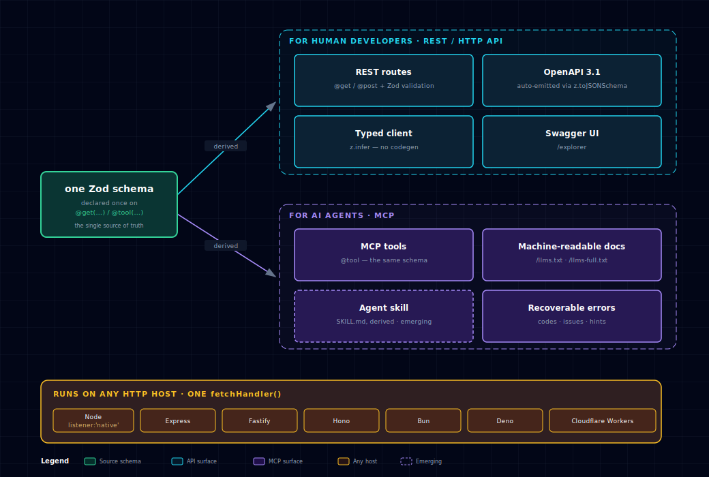

<p align="center">
  <a href="https://agentback.dev"></a>
</p>

<p align="center">
  <a href="https://www.npmjs.com/package/@agentback/core"></a>
  <a href="https://github.com/ninemindai/agentback/actions/workflows/ci.yml"></a>
  <a href="https://nodejs.org"></a>
  <a href="LICENSE"></a>
</p>

# AgentBack

AgentBack is an **AI-native API/MCP framework for the agent era**, built with
agents, for agents. It lets REST endpoints, MCP tools, generated docs, typed
clients, tests, and runtime validation all share one Zod contract.

## Why another API framework?

Your API has two audiences now: human developers and AI agents. Same operations,
different surfaces — REST and a typed client for devs, MCP tools and
machine-readable docs for agents.

Most stacks make you describe each operation four or five times: a Zod schema, an
OpenAPI block, an MCP tool definition, a client type. One contract, copied
everywhere. Add a field, edit all of them. Miss one, they drift — quietly, until
an agent sends the body your docs promised and your validator throws.

AgentBack describes it once.

```ts
const OrderId = z.object({id: z.string()});
const Order = z.object({id: z.string(), status: z.enum(['open', 'shipped'])});

@get('/orders/{id}', {path: OrderId, response: Order}) // → REST + OpenAPI + typed client
async getOrder(input) { /* … */ }

@tool('get_order', {input: OrderId, output: Order}) // → MCP tool, same schemas
async getOrderTool(input) { /* … */ }
```

One Zod schema becomes the validator, the `z.infer` type, the OpenAPI 3.1
contract, the MCP schema, the typed client, and the docs. Change the schema;
every boundary follows.

Not "LoopBack/Express, but newer." It's the layer that keeps one operation
coherent for the developers who build on your API and the agents that call it —
on a DI core you can extend, on any host (Node, Fastify, Hono, Bun, Deno,
Workers) from one `fetch` handler.

## What's inside

The foundation is a modern ESM port of LoopBack 4's proven dependency-injection
core: a hierarchical `Context` of `Binding`s with `@inject`, providers,
interceptors, extension points, lifecycle observers, and tag-based discovery.
REST controllers and MCP tool classes are just bindings the respective servers
find by tag — so adding a route or a tool is adding a class, not editing a
router file, an OpenAPI document, and a tool manifest.

- **ESM-only**, Node 22.13+, TypeScript 6.0
- **`Context` + `Binding` DI** with `@inject`, providers, interceptors, extensions, lifecycle observers
- **Zod-first** schemas; decorators accept `ZodType` directly
- **OpenAPI 3.1.1** emission via Zod v4's native `z.toJSONSchema`
- **MCP** (Model Context Protocol) server with the same decorator style as REST
- **Swagger UI** at `/explorer` and **MCP Inspector** at `/mcp-inspector`
- **AX artifacts**: `/llms.txt` + `/llms-full.txt` served from the same route registry
- **Machine-actionable errors**: stable codes, per-field issues, the violated
  schema, retryability, and remediation hints — same envelope on REST and MCP
- **Safety primitives**: `confirm:` (payload-bound confirmation tokens) and
  `idempotency:` (idempotency-key replay) on routes and tools
- **Tool cost report**: token-price the MCP tool surface before agents pay for it
- **Per-call pricing**: `@price('$0.001')` meters a route or tool and (with
  `installPriceGate`) refuses unpaid calls with an x402/MPP challenge
- **Typed HTTP client** without codegen when TypeScript consumers share schemas
- **Policy, auth, metering, payments, messaging, and observability** as DI components
- Built on the official `@modelcontextprotocol/sdk`

Status: **alpha**. End-to-end examples and tests pass; the API surface is
stabilizing but may still change between alpha releases.

## Positioning

The core product claim is **one schema, every boundary**. Compared with common
Node/TypeScript service stacks, AgentBack optimizes for teams whose APIs
are consumed by both applications and AI agents.

<p align="center">
  
</p>

<p align="center"><sub>One Zod schema → a REST/HTTP API for developers and an MCP surface for agents (tools, <code>/llms.txt</code>, a derived <code>SKILL.md</code>), served on any host from one <code>fetch</code> handler. · <a href="docs/architecture/diagrams/positioning.html">Interactive version →</a></sub></p>

| Stack             | Runtime contract    | Service contract                | Agent/tool contract        |
| ----------------- | ------------------- | ------------------------------- | -------------------------- |
| Express + raw Zod | Hand-wired Zod      | Hand-written OpenAPI            | Hand-written tool manifest |
| Fastify           | JSON Schema/TypeBox | OpenAPI via `@fastify/swagger`  | Custom adapter             |
| Hono              | Zod (validator)     | OpenAPI via `@hono/zod-openapi` | Custom adapter             |
| tRPC              | Zod                 | TypeScript-only                 | Custom adapter             |
| NestJS            | class-validator     | Swagger decorators              | Custom adapter             |
| FastAPI           | Pydantic            | OpenAPI from the same models    | Custom adapter             |
| **AgentBack**     | **Zod**             | **OpenAPI from same Zod**       | **MCP from same Zod**      |

Use it when you need HTTP APIs, MCP tools, docs, typed clients, policy checks,
and usage rails to stay coherent as the system grows.

**Fastify and Hono are transport runtimes, not competitors.** They solve HTTP
plumbing; AgentBack solves the layer above — one Zod schema projected to REST,
OpenAPI, _and_ MCP through a DI container. And it's host-portable: a
runtime-neutral `RestServer.fetchHandler()` runs the full pipeline (routing,
validation, DI, auth, streaming, uploads, MCP-over-HTTP) on Express, a native
Node listener, Fastify, Hono, Bun, Deno, and Workers — see
[`examples/hello-hosts`](examples/hello-hosts/README.md) and the
[HTTP hosts guide](docs/guides/deploy-to-edge.md).

## Documentation

Full docs live in **[`docs/`](docs/README.md)** — a guided path from the core
ideas to building real apps:

- **Blog** — [Design notes](docs/blog/index.html) ·
  [Boundary architecture map](docs/blog/diagrams/system-boundary.html)
- **Concepts** — [Dependency injection](docs/concepts/dependency-injection.md) ·
  [Schema-first decorators](docs/concepts/schema-first-decorators.md) ·
  [Components, servers & lifecycle](docs/concepts/components-servers-lifecycle.md)
- **Guides** — [Build a REST API](docs/guides/build-a-rest-api.md) ·
  [Build an MCP server](docs/guides/build-an-mcp-server.md) ·
  [Hybrid app (REST + MCP)](docs/guides/build-a-hybrid-app.md) ·
  [Composition & extensibility](docs/guides/composition-and-extensibility.md) ·
  [Testing](docs/guides/testing.md) ·
  [Secure MCP over HTTP](docs/guides/secure-mcp-over-http.md) ·
  [Deploy to production](docs/guides/deploy-to-production.md)
- **Architecture** — [Overview + diagrams](docs/architecture/overview.md) ·
  [Boundary-coherence design thesis](docs/agent-ergonomics.md)

The rest of this README is the one-page tour and code feel.

## Packages

The DI framework is the foundation; everything else is built on it. The full
catalog — DI foundation, REST/MCP/clients, and platform components — is in
**[docs/packages.md](docs/packages.md)**; each package also ships its own
`README.md` under [`packages/`](packages/).

## Quick start

```bash
pnpm install
pnpm build
pnpm -F hello-rest start    # REST + Swagger UI
pnpm -F hello-mcp test      # MCP over stdio (drives the server with a test client)
pnpm -F hello-hybrid start  # REST + MCP from one process, both UIs
```

## Reference app

For a complete, real-world build beyond the in-repo `hello-*` examples, see
**[ninemindai/agentback-demo](https://github.com/ninemindai/agentback-demo)** —
a Weather MCP server where one Zod schema set is served over stdio, authenticated
HTTP, and a dev console, backed by the free Open-Meteo API.

## For coding agents (Claude Code, Codex, …)

This repo ships an **agent skill** —
[`skills/agentback`](skills/agentback) — that teaches a coding agent the
framework's decorator patterns, slot-0 input-bundle convention, DI container,
auth stack, and schema-sharing client, with task-scoped reference files the
agent loads on demand. If you're building an app _with_ AgentBack and an
agent is doing the typing, install the skill first; it encodes the conventions
that aren't guessable from type signatures alone.

The easiest install is [skills.sh](https://skills.sh), which supports Claude
Code, Codex, Cursor, Copilot, Gemini, and 20+ other agents:

```bash
npx skills add ninemindai/agentback            # pick agents interactively
npx skills add ninemindai/agentback -a claude-code -a codex -y
npx skills add ninemindai/agentback -g -y      # user-global, all agents
```

Once installed, the agent discovers it automatically; it activates when a task
mentions `@agentback/*` packages, the REST/MCP decorators, or hybrid
Zod-shared apps.

**Agents without skill support** — the skill is plain markdown with a YAML
description. Point the agent at it from your instructions file (e.g.
`AGENTS.md`):

```markdown
When working with @agentback/\* packages, first read
skills/agentback/SKILL.md and the relevant file under
skills/agentback/references/ (REST, MCP tools, DI, auth, client sharing,
or composition) before writing code.
```

The skill's [`references/`](skills/agentback/references) directory splits the
deep material by task — `rest-and-openapi.md`, `mcp-tools.md`,
`dependency-injection.md`, `auth-and-rate-limiting.md`,
`schema-sharing-and-client.md`, `composition-and-operations.md` — so agents
pull only the context the current task needs.

## A 30-second feel

A full code walkthrough — the DI container, a REST service, and an MCP server, in
compiling TypeScript drawn from the packages. Expand it, or jump straight to the
runnable [`examples/`](examples/) and the [guides](docs/README.md).

<details>
<summary><b>Show the walkthrough</b></summary>

### DI container (works standalone, no HTTP needed)

```ts
import {Context, BindingScope, inject, injectable} from '@agentback/context';
import {Application} from '@agentback/core';

@injectable({scope: BindingScope.SINGLETON})
class Clock {
  now() {
    return new Date().toISOString();
  }
}

@injectable()
class Greeter {
  constructor(@inject('clock') private clock: Clock) {}
  greet(name: string) {
    return `Hello ${name} at ${this.clock.now()}`;
  }
}

const app = new Application(); // Application IS a Context
app.bind('clock').toClass(Clock);
app.service(Greeter); // tag-based service binding

const greeter = await app.get<Greeter>('services.Greeter');
console.log(greeter.greet('world'));
```

The same `Context`/`Binding`/`@inject` machinery is what the REST and
MCP servers below use under the hood — controllers and tool classes are
just tagged bindings the servers discover at start time.

### REST controller (Zod-validated)

```ts
import {z} from 'zod';
import {api, get, post} from '@agentback/openapi';
import {RestApplication} from '@agentback/rest';
import {inject} from '@agentback/context';

const HelloPath = z.object({name: z.string().min(1).max(64)});
const Greeting = z.object({greeting: z.string()});
const EchoIn = z.object({text: z.string().min(1).max(280)});
const EchoOut = z.object({echoed: z.string(), at: z.string()});

@api({basePath: '/greet'})
class GreetingController {
  @get('/hello/{name}', {path: HelloPath, response: Greeting})
  async hello(input: {path: z.infer<typeof HelloPath>}) {
    return {greeting: `Hello, ${input.path.name}!`};
  }

  @post('/echo', {body: EchoIn, response: EchoOut})
  async echo(
    input: {body: z.infer<typeof EchoIn>},
    @inject('clock') clock: {now(): string},
  ) {
    return {echoed: input.body.text, at: clock.now()};
  }
}

const app = new RestApplication();
app.bind('clock').to({now: () => new Date().toISOString()});
app.restController(GreetingController);
await app.start();
// GET /openapi.json -> OpenAPI 3.1.1
// POST /greet/echo with {"text":""} -> 422 with Zod issues
```

Schemas live once on each verb decorator. The handler receives a single
`input` object with `body`/`path`/`query`/`headers` keys derived via
`z.infer` — change a schema and the parameter type updates. `@inject`
weaves in at slot 1+; on routes with no input schemas, slot 0 is yours
too (e.g. `@get('/whoami') async whoami(@inject(USER) user) { … }`).

### MCP tool class

```ts
import {z} from 'zod';
import {mcpServer, tool, MCPComponent} from '@agentback/mcp';

const ForecastInput = z.object({
  city: z.string(),
  days: z.number().int().min(1).max(7),
});
const ForecastOutput = z.object({
  city: z.string(),
  forecast: z.string(),
});

@mcpServer()
class WeatherTools {
  @tool('get_forecast', {
    description: 'Returns the forecast for a city.',
    input: ForecastInput,
    output: ForecastOutput,
  })
  async getForecast(input: z.infer<typeof ForecastInput>) {
    return {city: input.city, forecast: 'sunny'};
  }
}

const app = new RestApplication();
app.component(MCPComponent); // registers MCPServer
app.service(WeatherTools); // tag flows from @mcpServer's @bind metadata
await app.start();
// stdio MCP transport active by default; mount mcp-inspector for a UI
```

The schemas live once, on the decorator. The parameter type is derived
via `z.infer<typeof ForecastInput>` — if you change the schema, TS
rewrites the parameter type. With `output:` declared, the return type
is _also_ constrained at compile time and validated at runtime; the MCP
SDK is given the schema so structured-content clients can consume it
directly. Omit `output:` to keep the method's return type unconstrained.

The `@mcpServer()` decorator uses `@bind({tags: {mcpServer: true}})` under the
hood. When you bind the class with `app.service()` (or `app.controller()`),
the framework reads that metadata via `createServiceBinding` and the
`mcpServer` tag is applied automatically — no manual `.tag()` call needed.

### The agent-native contract

Beyond schemas, the framework ships the conventions agents need from an API:

```ts
@post('/deploy', {body: DeployIn, response: DeployOut, confirm: true})
async deploy(input: {body: z.infer<typeof DeployIn>}) { … }
// 1st call -> 409 {error: {code: 'confirmation_required', confirmationToken, hint}}
// identical retry with x-confirmation-token header -> executes.
// The token is single-use and bound to the exact payload — a confirmed
// call cannot differ from the proposed one. Same flow on MCP tools via
// @tool(..., {confirm: true}) and a `confirmationToken` input property.

@post('/charge', {body: ChargeIn, response: ChargeOut, idempotency: true})
async charge(input: {body: z.infer<typeof ChargeIn>}) { … }
// Replaying an idempotency-key header returns the original result without
// re-executing; concurrent duplicates share one execution; errors aren't cached.
```

- **Errors are machine-actionable.** Every failure is
  `{error: {statusCode, code, message, issues?, schema?, retryable, hint?}}` —
  a stable `code` (never parse `message`), per-field `issues`, the violated
  section's JSON Schema inline, and a one-line remediation hint. MCP tool
  errors carry the **same envelope** as REST, so one parser self-corrects on
  both surfaces.
- **The API documents itself to agents.** `app.start()` serves `/llms.txt`
  (compact endpoint index) and `/llms-full.txt` (full inlined schemas) from
  the same registry as `/openapi.json`; `generateAgentContext()` renders an
  agent-context manual (CLAUDE.md shape) for the live API. Components append
  sections via the `AX_SECTION_TAG` binding tag — `installMcpHttp` adds the
  MCP tool listing automatically.
- **Tool definitions are a context budget.** `mcpServer.toolCostReport()`
  token-prices every `tools/list` entry and totals what each connection costs
  a caller's context window; `formatToolCostReport()` flags over-budget tools.

</details>

## Design pivots from the upstream LoopBack 4

Three packages were rewritten rather than ported wholesale because the
upstream code carries baggage the fork doesn't want:

- **`openapi`** — the upstream `@loopback/openapi-v3` is built around
  `openapi3-ts@2.x` loose types and a JSON-Schema-via-
  `@loopback/repository-json-schema` pipeline. We emit OpenAPI 3.1.1
  directly from Zod via `z.toJSONSchema({target: 'draft-2020-12'})`, which
  aligns with OpenAPI 3.1's dialect.
- **`rest`** — the upstream `@loopback/rest` is ~10k LoC of sequences,
  actions, and middleware composition. We have a minimal RestServer that
  handles routing, Zod request/body validation, error mapping, and serves
  the OpenAPI document.
- **`mcp-inspector`** — the official `@modelcontextprotocol/inspector` is
  a CLI tool, not an embeddable UI. We ship a small DOM-built inspector
  that talks to the in-process MCPServer directly via a JSON API.

The DI foundation (`metadata`, `context`, `core`) and the
`http-server` / `express` integrations are faithful ESM ports — same
source as upstream LoopBack 4, with `.js` extensions on relative
imports, `lodash` → `lodash-es`, and `p-event` v6 named exports. The
DI semantics (binding scopes, `@inject`, providers, interceptors,
extension points, observers) match `@loopback/context` and
`@loopback/core` exactly; if you know LB4 DI, you already know this.

## What's deferred

### Truly out of scope for v0

These are deliberately not in the framework — they reintroduce the upstream complexity the rewrite walked away from.

- **LB4 sequences/actions** (`findRoute → parseParams → invoke → send → reject` DI pipeline). `RestServer` is a monolithic dispatcher; per-route customization lives on the decorator, cross-cutting in middleware/interceptors, and deeper changes in subclassing `RestServer` and overriding `dispatch` / `sendResult` / `sendError`.
- **`@loopback/repository`** and the `Filter<T>` / `Where<T>` helpers.
- **`x-ts-type` inlining** — replaced by Zod schemas attached to route metadata.
- **`@oas.deprecated` / `@oas.tags` / `@oas.visibility`** decorator namespace.

### Already available, just not as polished

- **Middleware composition** — `@agentback/express` ships the LB4 middleware machinery, and `RestApplication` exposes `app.middleware(...)` and `app.expressMiddleware(...)`. Registered middleware runs through the framework's chain before every route handler.
- **CORS** — set `cors: true` (or pass `CorsOptions`) on `RestServerConfig`; the `cors` package is mounted globally.
- **MCP over Streamable HTTP** — `@agentback/mcp-http`'s `installMcpHttp(app)` exposes the in-process MCP server at `/mcp` so remote clients (Claude, Cursor) can reach the same tools; stdio remains the default. Supports OAuth 2.1 resource-server protection (`auth:` option + `/.well-known/oauth-protected-resource`), scope-based tool ACL (`@tool(..., {scope})`), and DNS-rebinding protection.

### Not yet implemented

- **MCP SSE (legacy) transport** — Streamable HTTP is supported; the older SSE transport is not.
- **MCP resource/prompt aggregation in the gateway** — `@agentback/mcp-host` aggregates upstream **tools** today; resource/prompt routing is a straightforward follow-on.

### About the test story

We use **Vitest** (2000+ tests across the workspace), not LB4's mocha/should ports. Tests run against built `dist/` — `pnpm build` before `pnpm test`.

## Development

Contributions welcome — see [CONTRIBUTING.md](CONTRIBUTING.md) for setup,
conventions, and the proposal process.

```bash
pnpm install          # install all workspace deps
pnpm build            # tsc -b across the workspace
pnpm test             # vitest run — IMPORTANT: requires a prior `pnpm build`
pnpm -F <pkg> build   # build a single package
```

**Tests run against built `dist/`.** `vitest.config.ts` globs
`packages/*/dist/__tests__/**/*.{test,spec,unit,integration,acceptance}.js`,
so editing a `.ts` file requires `pnpm build` (or `pnpm build:watch`)
before `pnpm test` sees the change.

TypeScript project references keep incremental builds fast. ESLint flat
config + Prettier match the LB4 conventions (single quotes, no bracket
spacing, 80 col).

### A note on the verb/tool input shape

Schemas live on the decorator (`@get`/`@post`/...'s options object,
`@tool`'s `input`/`output`). The handler always receives **one**
positional `input` bundle whose type is derived via `z.infer`. `@inject`
parameters live at slot 1+ when schemas are declared; when no schemas
are declared, slot 0 is free for `@inject` too. The slot-0 reservation
is enforced at decoration time, and URL placeholders are cross-checked
against the `path:` schema at `app.start()`.

## License

MIT.
