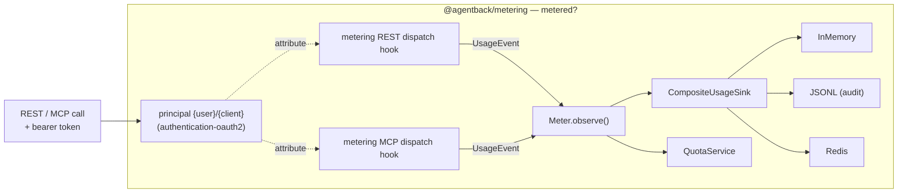
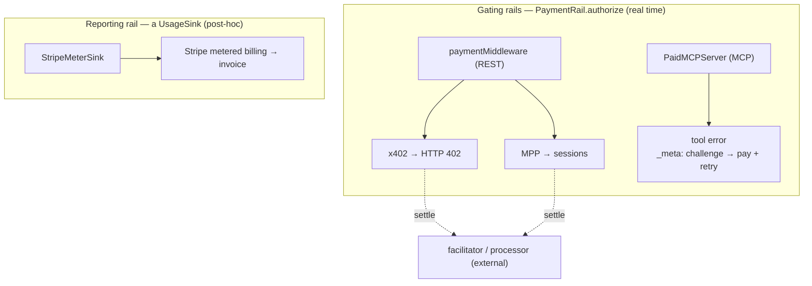

# Metering & payments

How every REST and MCP call gets **counted** (and attributed to a billable
identity), and how the calls that must be paid for get **gated** or **billed**.
Two small packages sit on top of the dispatch seams:

- **`@agentback/metering`** — the _metered?_ answer: a `Meter` emits
  a `UsageEvent` per call into pluggable sinks (the durable one is your audit
  log), plus a per-principal `QuotaService`.
- **`@agentback/payments`** — the _paid?_ answer: a `PaymentRail`
  seam with **x402** (per-call HTTP 402), **MPP** (pre-authorized sessions), and
  **Stripe** (usage-log metered billing).

> A polished, standalone version of the diagram below lives at
> [`diagrams/metering-and-payments.html`](diagrams/metering-and-payments.html) —
> open it in a browser.

This is the framework realization of three questions an enforcement point asks
per call — `may-call?` (policy, the [auth stack](overview.md#package-layering)),
`paid?` (rail), `metered?` (billing). Auth answers the first; these two packages
answer the other two, and both hang off the **principal the auth layer already
produces**.

## Metering data flow

Every call crosses one of two `protected` dispatch seams. A metered subclass
wraps it, times the call, and records a `UsageEvent` attributed to the
request's principal.



**The shape to remember:** the auth principal is the billable identity; the
metered server is a thin subclass over the existing dispatch; one `UsageEvent`
fans out to as many sinks as you bind.

### The seams

`RestServer.dispatch` / `sendResult` / `sendError` and `MCPServer.dispatchTool`
are `protected` (see [composition & extensibility](../guides/composition-and-extensibility.md#subclassing-the-dispatcher)).
The metered servers subclass them and emit around the base call:

```ts
import {MeteredRestServer, MeteringComponent} from '@agentback/metering';

const app = new RestApplication({});
app.server(MeteredRestServer, 'RestServer'); // replaces the default at the same key
app.component(MeteringComponent); // in-memory sink + quota + Meter
```

`MeteredMCPServer` does the same for tools. With no `Meter` bound, both behave
exactly like their base server — safe to install unconditionally. The principal
is read from the auth result (REST) or the request context (MCP), so a metered
call carries `{user}`/`{client}` even though authentication runs _inside_ the
wrapped dispatch.

### The event

```ts
interface UsageEvent {
  id: string; // ulid; also the idempotency key for sinks
  at: string; // ISO timestamp
  principal: {kind: 'user' | 'client' | 'anonymous'; id: string};
  surface: 'rest' | 'mcp';
  operation: string; // 'Controller.method' or tool name
  status: 'ok' | 'error' | 'denied' | 'rate_limited' | 'payment_required';
  latencyMs: number;
  units: number; // billable units (default 1)
  cost?: {amount: string; currency: string}; // priced downstream, not here
}
```

`status` is what makes the log an audit trail rather than a counter: a refused
call (`denied`/`rate_limited`/`payment_required`) is **recorded with why, but
not billed**. `units` is the seam between "a call happened" and "a call cost N";
the price lives downstream.

### Sinks

A `UsageSink` is just `record(event)`. Pick one, or fan out with
`CompositeUsageSink`:

| Sink                 | Durability                   | Use                                           |
| -------------------- | ---------------------------- | --------------------------------------------- |
| `InMemoryUsageSink`  | process-local, queryable     | dev, tests, the buffer behind a flushing sink |
| `JsonlUsageSink`     | append-only file, replayable | the durable **audit log** (rung-1 asset)      |
| `RedisUsageSink`     | shared across processes      | multi-instance deployments (SADD-deduped)     |
| `CompositeUsageSink` | fan-out                      | record to audit **and** bill from one event   |

All sinks are idempotent on `UsageEvent.id`, so replaying a log is safe.

### Quota

`QuotaService.check(principalId)` / `consume(...)` is the _metered?_ enforcement
arm — per-principal limits, independent of any rail. The default
`InMemoryQuotaService` is a cumulative counter vs a limit map; a windowed or
prepaid-credit policy is a downstream implementation of the same interface.

> See `examples/hello-oauth2`: it swaps in `MeteredRestServer`, and
> `GET /admin/usage` prints the recorded events — `user:user-alice ok`,
> `client:svc-importer ok`, `user:user-bob denied` (403), `anonymous denied`
> (401). The auth principal flows all the way to attributed usage.

## Payment rails

Two _kinds_ of rail, deliberately different shapes:



- **Gating rails** answer `paid?` at call time. `PaymentRail.authorize(ctx)`
  returns either a `paid` receipt or a `payment_required` challenge.
- **The reporting rail** (Stripe) does _not_ gate — it forwards billable events
  to Stripe, which invoices on its own cycle. It is a `UsageSink`, not a
  `PaymentRail`.

**We orchestrate, we don't settle:** every rail delegates the on-chain transfer
or card movement to an external facilitator/processor, injected as an interface
(and faked in tests).

### x402 (per-call HTTP 402)

```ts
import {X402Rail, paymentMiddleware} from '@agentback/payments';

const rail = new X402Rail({
  facilitator,
  requirements: ctx => [
    /* PaymentRequirements */
  ],
});
restServer.expressApp.post('/premium', paymentMiddleware(rail), handler);
```

No `X-PAYMENT` header → `402` + the `accepts` requirements. A presented payment
is `verify`-ed and `settle`-d through the facilitator; success sets
`X-PAYMENT-RESPONSE` and runs the handler. Best for the long tail of cheap
calls. See `examples/hello-x402` for the full 402 → pay → 200 flow against an
in-process fake facilitator.

### MPP (pre-authorized sessions)

```ts
import {MppRail, InMemoryMppSessionStore} from '@agentback/payments';

const store = new InMemoryMppSessionStore();
store.open({id: 'sess_1', limit: 1000, spent: 0}); // processor opens this out of band
const rail = new MppRail({store, cost: () => 1}); // callers send X-MPP-SESSION
```

Instead of settling per call, MPP streams against a pre-authorized budget — an
MPP session _is_ the per-principal budget the `QuotaService` models. Missing /
expired / exhausted → `402` with an MPP challenge. The natural MCP rail (no
per-call round-trip).

### Stripe (usage-log metered billing)

The enterprise path — fiat, no crypto, no gating. `StripeMeterSink` is a
`UsageSink` that forwards billable events to Stripe. Compose it with the audit
sink so one event both records and bills:

```ts
app
  .bind(MeteringBindings.SINK)
  .to(
    new CompositeUsageSink([
      new JsonlUsageSink('usage.jsonl'),
      new StripeMeterSink(reporter),
    ]),
  );
```

Only `status: 'ok'` bills by default; the event id is the Stripe idempotency
`identifier`, so re-reporting a log is safe.

## Paying for MCP tools

MCP is JSON-RPC — there is no HTTP `402`. So a paid tool called without proof
returns a **tool error carrying the challenge in `_meta`**; the agent reads it,
pays, and retries. `PaidMCPServer` wires it, and over MCP-over-HTTP it is
**end-to-end with no per-app glue** — the proof travels in request headers
(`X-PAYMENT` / `X-MPP-SESSION`), exposed to tools via `MCPBindings.REQUEST_INFO`:

```ts
import {PaidMCPServer, PaymentMcpBindings} from '@agentback/payments';

app.server(PaidMCPServer, 'MCPServer');
app.bind(PaymentMcpBindings.OPTIONS).to({
  railFor: tool => (tool === 'premium_search' ? rail : undefined),
});
```

A free tool passes straight through. A paid tool with no proof returns
`{isError: true, content: [...], _meta: {'payments/challenge': <challenge>}}`.
This reuses the framework's existing escape hatch — a `dispatchTool` result with
a `content` field passes through to the MCP SDK verbatim — rather than throwing,
so the structured challenge survives to the client.

## How it composes

- **Metering and payments are complementary.** Metering records _every_ call
  (the audit log); a gating rail blocks the unpaid ones; the Stripe sink bills
  the recorded ones. A gated paid call still emits a `UsageEvent`; a `402` emits
  one with `status: 'payment_required'`.
- **Identity is shared.** The `{user}`/`{client}` principal from
  [`authentication-oauth2`](../../packages/authentication-oauth2/README.md) is
  the billable account for both — "who do I charge?" is answered per request by
  the auth layer.
- **Everything is a binding.** Sinks, quota, the meter, the rails, and the paid
  servers are bound in the same `Context` and discovered the same way as any
  other capability — swap the in-memory sink for Redis, or the fake facilitator
  for a real one, by rebinding.

## Non-goals

No custody, no on-chain broadcasting in-process, no card vault, no IdP. The
substrate records `units`; an external billing system prices and bills; an
external facilitator/processor settles. The rails and metering carry the seam so
a route or tool node can declare its rail later without a code change.
