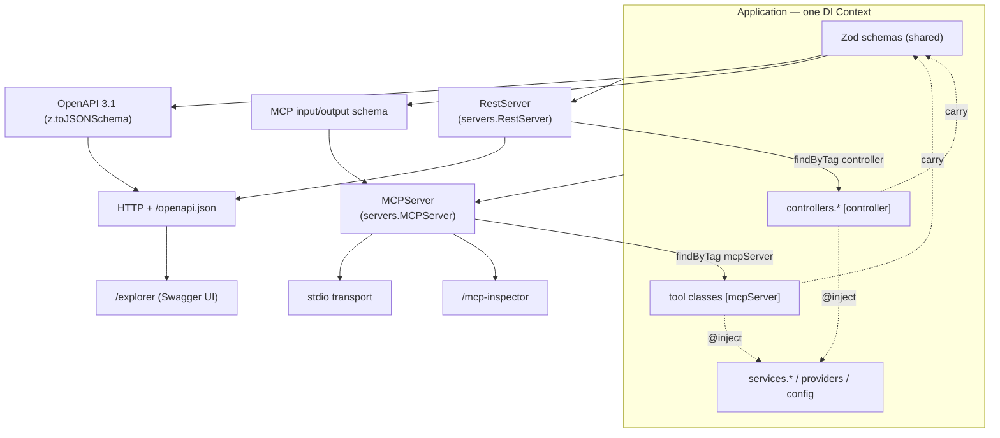
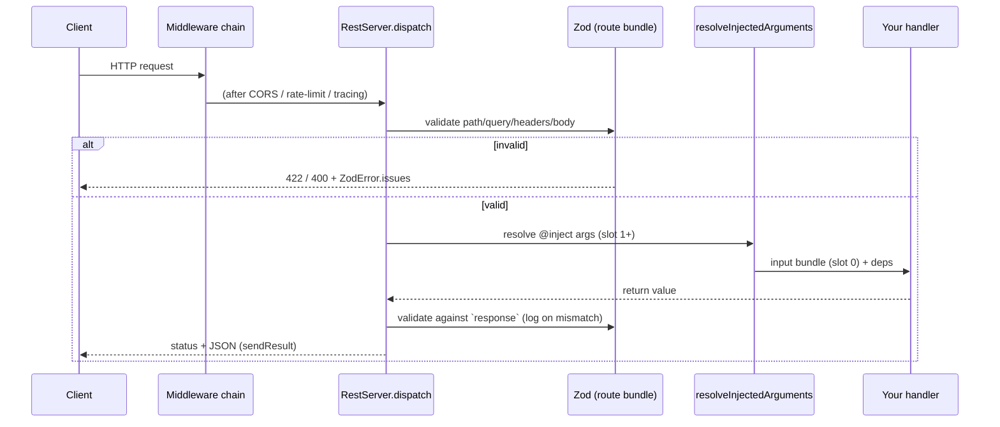
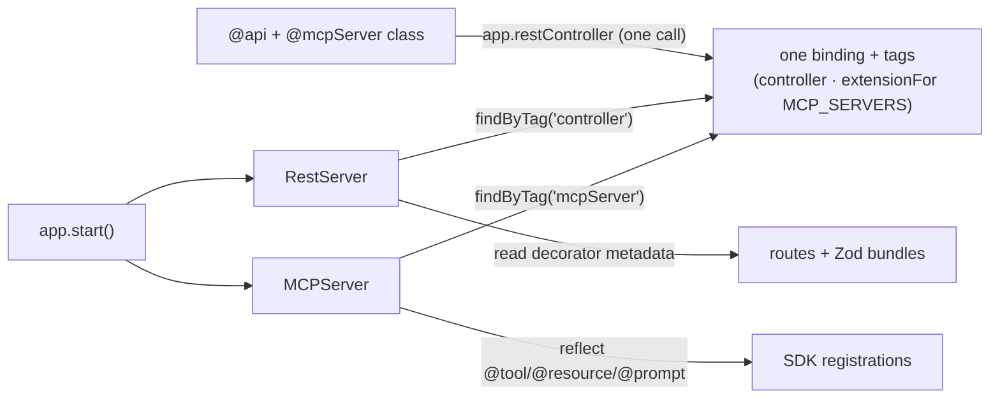
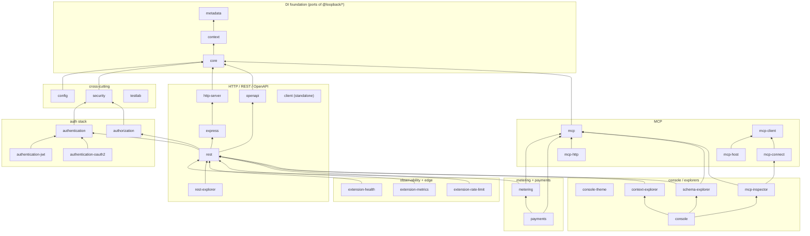
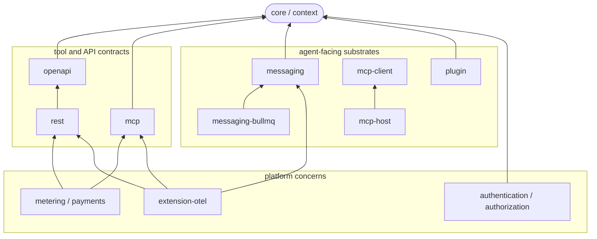

# Architecture overview

How the pieces fit, how a request flows, and how the packages layer. If you've
read the [concepts](../concepts/dependency-injection.md), this ties them
together.

> A polished, standalone version of the system diagram below lives at
> [`diagrams/system-architecture.html`](diagrams/system-architecture.html) —
> open it in a browser.

## The system at a glance

Everything is a binding in one `Context`. The servers are bindings too; they
discover your code by tag at startup and expose it over their transport. The
same Zod schemas feed validation, OpenAPI, and MCP contracts.

The shape to remember: **one container in the middle; servers on the edges
discovering bindings by tag; schemas radiating out to every contract.**

## How a REST request flows

- **Middleware** runs first and can short-circuit (preflights, throttling,
  probes).
- **Validation** happens before your code — a bad request never reaches the
  handler.
- **Injection** weaves dependencies at slot 1+; the validated input bundle is
  slot 0.
- **`dispatch` / `sendResult` / `sendError`** are the `protected` seams you
  [subclass](../guides/composition-and-extensibility.md#subclassing-the-dispatcher)
  to reshape the pipeline.

An MCP tool call follows the analogous path inside `MCPServer.dispatchTool`:
parse input → weave injects → apply method → validate output.

## How discovery works

No router file, no central switch. Servers find your code by querying the
container at start time.

This is why "add a feature" = "add a binding": the discovery step picks it up
with zero wiring.

## Package layering

The DI foundation is the base; servers, integrations, and the agent runtime
build up from it. Every package has its own `README.md` with exports and a usage
snippet. An arrow means "depends on."

Notes:

- **`metadata → context → core`** is the DI foundation, a faithful ESM port of
  `@loopback/{metadata,context,core}`. Know LB4 DI and you know this layer.
  `core` re-exports `context`, which re-exports `metadata` — most consumers only
  import `@agentback/core`.
- **`openapi`, `rest`, `mcp`** are rewrites (see the [design pivots](../../README.md#design-pivots-from-the-upstream-loopback-4)).
- **`config`, `security`** are cross-cutting; the **auth stack** (`authentication`,
  `authentication-jwt`, `authentication-oauth2`, `authorization`) builds on
  `security` and is woven into `rest`'s dispatch pipeline.
- **`metering`, `payments`** subclass the dispatchers to count every
  call (`metered?`) and gate/bill the paid ones (`paid?` — x402 / MPP / Stripe).
  They hang off the principal the auth stack produces — see
  [metering & payments](metering-and-payments.md).
- **`client`** depends on **none** of the above — it only needs `zod`, so it's
  browser-safe and shares schemas with the server without importing the server.
- The **MCP client family** (`mcp-client`, `mcp-host`, `mcp-connect`) is a
  standalone path for _consuming_ upstream MCP servers, distinct from `mcp`
  (which _serves_ tools).
- The UI packages (`rest-explorer`, `mcp-inspector`, `context-explorer`,
  `schema-explorer`, `console`) mount on a running server; `console-theme` is
  shared styling. `schema-explorer` reads **both** `rest` and `mcp` — it indexes
  the app by Zod schema and joins each entity to the routes and tools that use
  it (the inverse of the per-protocol explorers).

## Agent-facing runtime pieces

The packages in this repo stop at framework and substrate boundaries. They give
agent applications the core primitives for tools, durable work, gatewaying, and
plugins, but they do not currently ship a higher-level turn loop or orchestration
runtime.

- **Tool serving** — [`mcp`](../../packages/mcp/README.md) exposes decorated
  tool classes over MCP, with the same Zod schemas used for runtime validation
  and tool contracts.
- **Tool consumption** — [`mcp-client`](../../packages/mcp-client/README.md) and
  [`mcp-host`](../../packages/mcp-host/README.md) connect to and aggregate
  upstream MCP servers.
- **Durable work** — [`messaging`](../../packages/messaging/README.md) defines
  Zod-typed `JobQueue`, `EventBus`, `Scheduler`, and `QueueAdmin` ports;
  [`messaging-bullmq`](../../packages/messaging-bullmq/README.md) implements
  those ports over BullMQ and Redis Streams.
- **Runtime extension** — [`plugin`](../../packages/plugin/README.md) discovers
  and gates components; `metering`, `payments`, and `extension-otel` compose via
  dispatcher hooks and server seams.

## Where the boundaries are the same artifact

The thing that distinguishes this framework: a single Zod schema is the
validator, the `z.infer` type, the OpenAPI parameter/response, the MCP
input/output, and the rendered docs — simultaneously. Changing it changes all of
them in one edit, and disagreements surface as a **TypeScript error at the
decorator**, a **startup throw**, or a **failing test** — three localized
signals instead of one vague one.

That property, not any single feature, is the framework's bet. The full argument
is in the [boundary-coherence design thesis](../agent-ergonomics.md).

## Next

- Back to the [concepts](../concepts/dependency-injection.md) or
  [guides](../guides/build-a-rest-api.md).
- The [design thesis](../agent-ergonomics.md) for the "why."
