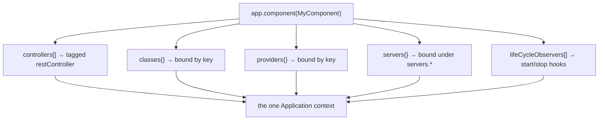

# Concept: Components, Servers & Lifecycle

[Dependency injection](dependency-injection.md) gives you a container of
bindings. This doc covers the three pieces that turn that container into a
runnable application: **components** package bindings, **servers** expose them
over a transport, and the **lifecycle** starts and stops everything in order.

> Package: [`@agentback/core`](../../packages/core).

## Component — a bundle of bindings

A `Component` is the unit of reuse. It's a class that declares bindings to add
to the application: controllers, providers, classes, servers, and lifecycle
observers. Registering it with `app.component(C)` merges all of that into the
container in one call.

```ts
import {Component, Application} from '@agentback/core';

class GreetingComponent implements Component {
  controllers = [GreetingController];
  classes = {'services.Clock': Clock};
  providers = {'services.Token': TokenProvider};
  // servers = {MCPServer};               // contribute a server
  // lifeCycleObservers = [MetricsFlush];  // run code on start/stop
}

const app = new Application();
app.component(GreetingComponent);
```

This is how the framework ships capabilities. `MCPComponent`,
`JWTAuthenticationComponent`, the health and metrics extensions — each is a
`Component` you drop in with one line. Your own cross-cutting features (a tenant
resolver, an audit log, a set of admin tools) become components too, which is
what keeps large apps composable: a feature is a component, not a diff against
`main()`.



## Server — exposes bindings over a transport

A `Server` is a `LifeCycleObserver` with a `listening` flag. The framework ships
two:

- **`RestServer`** ([`@agentback/rest`](../../packages/rest)) — discovers
  bindings tagged `restController`, builds routes from their decorator metadata,
  validates with Zod, serves `/openapi.json`.
- **`MCPServer`** ([`@agentback/mcp`](../../packages/mcp)) — discovers
  bindings tagged `mcpServer`, registers their `@tool`/`@resource`/`@prompt`
  methods with the MCP SDK, runs a transport (stdio by default).

Both are just bindings under `servers.*`. You don't instantiate them directly —
you register them (often via a component or a `RestApplication`) and the
application's lifecycle starts them.

```ts
import {RestApplication} from '@agentback/rest';
import {MCPComponent} from '@agentback/mcp';

const app = new RestApplication(); // binds servers.RestServer for you
app.component(MCPComponent); // binds servers.MCPServer
app.configure('servers.RestServer').to({port: 3000});
await app.start(); // starts BOTH servers
```

A server discovers controllers/tools at **start time** by querying the container
for the relevant tag. That's why adding a controller is just
`app.restController(C)` — no router edit, no manual registration. The
[architecture overview](../architecture/overview.md) traces this discovery step
by step.

### Writing your own server

Implement `Server` (extend the lifecycle), bind it under `servers.*`, and the
app will start/stop it with everything else:

```ts
import {Server, Application} from '@agentback/core';

class MetricsServer implements Server {
  private _listening = false;
  get listening() {
    return this._listening;
  }
  async start() {
    /* open a port, begin scraping… */ this._listening = true;
  }
  async stop() {
    this._listening = false;
  }
}
app.server(MetricsServer); // bound under servers.MetricsServer, tagged `server`
```

## Lifecycle — start and stop, in order

`Application` extends a `LifeCycleObserver` registry. `await app.start()` and
`await app.stop()` drive every registered observer (servers included) through
three optional hooks:

| Hook      | When                            | Typical use                     |
| --------- | ------------------------------- | ------------------------------- |
| `init()`  | once, before first start        | one-time setup                  |
| `start()` | on `app.start()`                | open ports, connect transports  |
| `stop()`  | on `app.stop()` (reverse order) | graceful shutdown, flush, close |

```ts
import {lifeCycleObserver, LifeCycleObserver} from '@agentback/core';

@lifeCycleObserver('metrics')
class MetricsFlusher implements LifeCycleObserver {
  async start() {
    /* begin periodic flush */
  }
  async stop() {
    /* flush remaining + clear timer */
  }
}
app.lifeCycleObserver(MetricsFlusher);
```

Observers run in groups, and **stop runs in reverse start order** so dependencies
shut down after their dependents. `RestServer`/`MCPServer` use these same hooks —
they have no privileged lifecycle, they're observers like any other. The HTTP
server stops gracefully (drains in-flight requests) on `stop()`.

## Putting it together

A typical app is: construct an application, add components, register your
controllers/tools/services, configure servers, start.

```ts
const app = new RestApplication();
app.component(JWTAuthenticationComponent); // a feature bundle
app.component(MCPComponent); // adds servers.MCPServer
app.restController(GreetingController); // REST surface
app.controller(WeatherTools); // MCP surface — controller() so @inject resolves
app.configure('servers.RestServer').to({port: 3000});
await app.start(); // both servers up, controllers + tools discovered
// … later
await app.stop(); // graceful shutdown of everything, reverse order
```

## Next

- [Build a REST API](../guides/build-a-rest-api.md) — the REST server end to end.
- [Build an MCP server](../guides/build-an-mcp-server.md) — the MCP server end to end.
- [Composition & extensibility](../guides/composition-and-extensibility.md) —
  components, middleware, interceptors, and extension points in depth.
