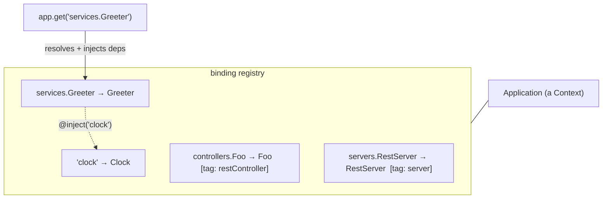

# Concept: Dependency Injection

The DI container is the foundation the entire framework stands on. REST and MCP
are just two ways to expose bindings that live in it. Understand this layer and
the rest of the framework becomes "bind a class, tag it, a server finds it."

> Packages: [`@agentback/context`](../../packages/context) (the container)
> and [`@agentback/core`](../../packages/core) (`Application`, which _is_ a
> context). The DI semantics match `@loopback/context` / `@loopback/core`
> exactly — if you know LoopBack 4 DI, you already know this.

## The three nouns



- **`Context`** — a registry of bindings plus a resolver. Contexts form a
  hierarchy (an app context, a per-server child, a per-request child); a lookup
  walks up the chain.
- **`Binding`** — maps a **key** (e.g. `services.Greeter`) to a **value
  source** (a constant, a class, a provider, an alias) with a **scope** and a
  set of **tags**.
- **`@inject`** — declares, on a constructor parameter or property, _which
  binding_ supplies a value. The container resolves and injects it.

The key mental model: **the `Application` is itself a `Context`.** `app.bind(...)`,
`app.get(...)`, `app.find(...)` are `Context` methods. Servers, components, your
controllers — all bindings in that one container.

## Binding a value

```ts
import {Application} from '@agentback/core';
import {BindingScope} from '@agentback/context';

const app = new Application();

// a constant
app.bind('config.apiBase').to('https://api.example.com');

// a class (constructed lazily, deps injected)
app.bind('services.Clock').toClass(Clock);

// a provider (a class with a value() method, for async/computed values)
app.bind('services.Token').toProvider(TokenProvider);

// an alias (another binding's value, by key)
app.bind('services.Now').toAlias('services.Clock');

// a dynamic value (recomputed each resolution unless scoped)
app.bind('now').toDynamicValue(() => Date.now());
```

Resolve with `await app.get(key)` (async — providers may be async) or
`app.getSync(key)` when you know the value is synchronous.

## Scopes — how often a value is created

Set with `.inScope(...)` or the `@injectable({scope})` decorator. The ones you
will actually use:

| Scope                 | Meaning                                                                                         |
| --------------------- | ----------------------------------------------------------------------------------------------- |
| `TRANSIENT` (default) | A fresh value on every resolution.                                                              |
| `SINGLETON`           | One value for the whole application, cached on the owning context.                              |
| `CONTEXT`             | One value per context that resolves it (e.g. per request when resolved from a request context). |

```ts
import {injectable, BindingScope} from '@agentback/context';

@injectable({scope: BindingScope.SINGLETON})
class Clock {
  now() {
    return new Date().toISOString();
  }
}
app.bind('services.Clock').toClass(Clock); // honors the @injectable scope
```

Other scopes (`APPLICATION`, `SERVER`, `REQUEST`) exist for advanced
hierarchical setups; default to `TRANSIENT` for stateless logic and `SINGLETON`
for shared state or expensive construction.

## `@inject` — declaring dependencies

`@inject` works on constructor parameters and properties. The value is resolved
when the owning binding is constructed.

```ts
import {inject} from '@agentback/context';

class Greeter {
  // constructor injection (preferred)
  constructor(@inject('services.Clock') private clock: Clock) {}

  greet(name: string) {
    return `Hello ${name} at ${this.clock.now()}`;
  }
}
```

### Typed binding keys

A plain string key is untyped. `BindingKey.create<T>()` ties a key to a type so
`@inject` and `app.get` are type-checked and discoverable:

```ts
import {BindingKey} from '@agentback/context';

export const CLOCK = BindingKey.create<Clock>('services.Clock');

app.bind(CLOCK).toClass(Clock);
class Greeter {
  constructor(@inject(CLOCK) private clock: Clock) {} // Clock inferred
}
```

This is the recommended pattern for anything you expose for others to inject —
it turns "what's behind this string?" into a go-to-definition.

### `@inject` variants

| Variant                          | Injects                                                             |
| -------------------------------- | ------------------------------------------------------------------- |
| `@inject(key)`                   | The resolved value.                                                 |
| `@inject(key, {optional: true})` | The value, or `undefined` if unbound (no throw).                    |
| `@inject.getter(key)`            | A `() => Promise<T>` you call later (defers resolution).            |
| `@inject.setter(key)`            | A `(value) => void` to rebind at runtime.                           |
| `@inject.tag(tag)`               | An **array** of all values whose binding carries `tag`.             |
| `@inject.view(filter)`           | A live `ContextView` that updates as matching bindings come and go. |
| `@inject.context()`              | The owning `Context` itself (use sparingly).                        |
| `@config()`                      | The configuration bound for the current binding (see below).        |

`@inject.tag` is the workhorse of extensibility — see
[Composition & extensibility](../guides/composition-and-extensibility.md).

## Tags and discovery

A binding can carry **tags** (name/value pairs). The framework finds bindings by
tag instead of by hard-coded references — this is how servers locate your code
without you registering it in a router.

```ts
app.bind('controllers.Foo').toClass(Foo).tag('restController');

// find everything tagged — what RestServer does at startup
const controllers = app.findByTag('restController'); // Binding[]
```

You rarely call `.tag()` by hand. The class decorators put the tag in metadata,
and the registration helpers apply it for you:

| Helper                  | Tag applied                                                    | Found by                   |
| ----------------------- | -------------------------------------------------------------- | -------------------------- |
| `app.restController(C)` | `restController`                                               | `RestServer`               |
| `app.service(C)`        | `service` (+ `extensionFor: MCP_SERVERS` if `@mcpServer()`)    | DI / MCP server            |
| `app.controller(C)`     | `controller` (+ `extensionFor: MCP_SERVERS` if `@mcpServer()`) | binds `controllers.<name>` |
| `app.component(C)`      | — (registers the component's bindings)                         | —                          |
| `app.server(C)`         | `server`                                                       | `Application` lifecycle    |

`@mcpServer()` is built on `@injectable`: it tags the class
`extensionFor: MCP_SERVERS` (and defaults it to singleton scope); when you
`app.service(WeatherTools)`, the framework reads that metadata and tags the
binding automatically — see the
[MCP guide](../guides/build-an-mcp-server.md#how-discovery-works).

**Register tool classes with `app.service(C)`** — a tool is a service. The MCP
server discovers it as an `MCP_SERVERS` extension and resolves the instance
through its binding, so constructor `@inject` is honored regardless of namespace
(`service`, `controller`, or a manual `bind().apply(extensionFor(MCP_SERVERS))`).
A dual REST + MCP class (`@api` + `@mcpServer`) needs **both** `restController`
(the REST routes) and `service` (the MCP extension), since `restController` tags
it for REST only.

## Configuration

Any binding can have a sidecar configuration binding. Inject it with `@config()`:

```ts
import {config} from '@agentback/context';

class MailService {
  constructor(@config() private cfg: {from: string}) {}
}
app.bind('services.Mail').toClass(MailService);
app.configure('services.Mail').to({from: 'noreply@example.com'});
```

Servers use exactly this mechanism: `app.configure('servers.RestServer').to({port: 3000})`.

## Why this matters for composition

Because every capability is a binding discovered by tag:

- **Adding a feature never edits central code.** A new controller, tool, auth
  strategy, or health check is a new binding. Nothing downstream changes.
- **Swapping for tests is one line.** `app.bind('services.Clock').to(fakeClock)`
  overrides the real one; no module-mock machinery.
- **Reasoning stays local.** A class declares its dependencies in its
  constructor. There's no hidden global to trace.

These properties are what the [composition guide](../guides/composition-and-extensibility.md)
builds on, and why the framework scales to multi-team / plugin / AI-tool
surfaces.

## Standalone use

You don't need HTTP or MCP to use the container. It's a fine general-purpose DI
system for any Node app:

```ts
const app = new Application();
app.bind('services.Clock').toClass(Clock);
app.service(Greeter);
const greeter = await app.get<Greeter>('services.Greeter');
console.log(greeter.greet('world'));
```

## Next

- [Schema-first decorators](schema-first-decorators.md) — how routes and tools
  are declared on top of this container.
- [Components, servers & lifecycle](components-servers-lifecycle.md) — how the
  servers themselves are bindings.
