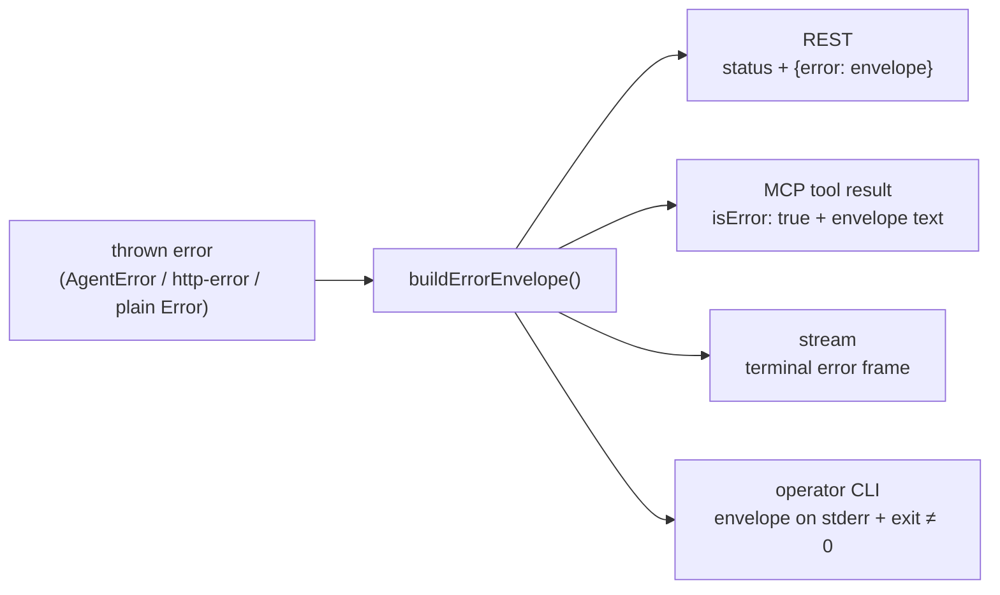

# Concept: The error contract

Every surface of an AgentBack app — REST responses, MCP tool results, SSE/JSONL
stream terminations, the operator CLI — emits the **same machine-actionable
error envelope**, built by one function (`buildErrorEnvelope`) from whatever
was thrown. An agent that can parse one surface's errors can self-correct on
all of them, and a domain service throws the same error class no matter which
transport called it.

> Package: [`@agentback/openapi`](../../packages/openapi) exports `AgentError`,
> `ErrorCodes`, `ErrorEnvelope`, and `buildErrorEnvelope`;
> [`@agentback/rest`](../../packages/rest) adds the REST-specific
> `invalidParameter` / `invalidRequestBody` constructors.

## One envelope, every surface



The envelope's fields are designed for a caller that wants to **fix the
request, not read a stack trace**:

| Field               | Meaning                                                                                                 |
| ------------------- | ------------------------------------------------------------------------------------------------------- |
| `code`              | Stable machine-readable identifier (`invalid_body`, `unauthorized`, …). Parse this, never `message`.     |
| `message`           | Human-readable text (redacted for unintentional 5xx — see below).                                        |
| `issues`            | Per-field validation failures (`path` + expected/received). REST also mirrors it as `details`.           |
| `schema`            | JSON Schema of the violated input section, so the caller can re-shape without a `/openapi.json` round-trip. |
| `retryable`         | Whether retrying the *same operation* with corrected input/credentials can succeed.                      |
| `hint`              | One-line remediation instruction written for an agent (defaulted per `code`).                            |
| `confirmationToken` | Rides on `confirmation_required` errors — the token for the `confirm:` retry.                            |
| `challenge`         | Rides on `payment_required` errors — how to pay (x402 requirements, MPP session).                         |

How each surface carries it:

- **REST** — HTTP status + `{"error": {code, message, issues?, details?,
  schema?, retryable, hint?, …}}`.
- **MCP** — tool failures are `isError: true` results (not protocol errors),
  with the envelope JSON as the content text; `statusCode` is dropped (HTTP
  semantics don't apply).
- **Streams** — once headers are flushed a status change is impossible, so a
  mid-stream failure becomes a terminal error frame (SSE `event: error` /
  a JSONL `{"error":{…}}` line) carrying the same envelope. Errors thrown
  *before* the first item still get a real HTTP status — see the
  [streaming guide](../guides/streaming.md).
- **Operator CLI** — the envelope prints to stderr and the exit code goes
  non-zero; stdout stays reserved for the tool's result.

## The redaction rule

**A plain `Error` thrown from a service, controller, or `@tool` is redacted to
a generic 500** — `code: internal_error`, `message: "Internal Server Error"` —
on every surface. Its message may contain connection strings, file paths, or
library internals, so it never reaches the caller (it is still logged
server-side).

`AgentError` is the opt-in for messages that *should* reach the caller:

```ts
import {AgentError, ErrorCodes} from '@agentback/openapi';

// In a domain service — no transport imports, works on REST, MCP, CLI alike:
if (!city && lat == null) {
  throw new AgentError('Provide either a city or both coordinates.', {
    code: ErrorCodes.INVALID_INPUT, // status defaults to 400
  });
}
```

Constructor options (all optional): `status` (default `400` — a
client-correctable error), `code` (defaulted from the status), `issues`,
`hint` (defaulted from the code), `retryable` (defaulted from status/code),
`schema`, and `cause` (forwarded to `Error#cause`). An `AgentError`'s message
is treated as public **even for an intentional 5xx** — it sets
`publicMessage`, which is what the redaction rule checks.

Errors from `http-errors` (`createError(404, …)`) also survive: the envelope
builder reads `status`/`statusCode`/`code`/`details` off any thrown object and
fills the rest from defaults. The redaction applies only to 5xx messages
without a `publicMessage`.

## Framework error codes

`ErrorCodes` enumerates the stable codes the framework itself emits; user code
extends the set freely (any string is a valid `code`).

| Code                       | Default status | Retryable | Emitted by                                        |
| -------------------------- | -------------- | --------- | ------------------------------------------------- |
| `invalid_parameter`        | 400            | yes       | path/query/header validation                      |
| `invalid_body`             | 422            | yes       | body validation                                   |
| `invalid_input`            | 400            | yes       | MCP tool input validation, domain `AgentError`s   |
| `invalid_output`           | 500            | no        | MCP tool output validation                        |
| `unauthorized`             | 401            | no        | authentication strategies                         |
| `forbidden`                | 403            | no        | `@authorize` voters                               |
| `not_found`                | 404            | no        | route/tool lookup, domain code                    |
| `conflict`                 | 409            | no        | domain code                                       |
| `confirmation_required`    | 409            | yes       | `confirm:` first call (carries `confirmationToken`) |
| `confirmation_invalid`     | 409            | yes       | `confirm:` bad/expired/mismatched token           |
| `payment_required`         | 402            | yes       | `@agentback/payments` (carries `challenge`)       |
| `idempotency_key_required` | 400            | yes       | `idempotency: {required: true}` without a key     |
| `rate_limited`             | 429            | yes       | `@agentback/extension-rate-limit`                 |
| `internal_error`           | 500            | no        | anything redacted                                 |

"Retryable" follows one principle: **can retrying the same operation succeed
if the caller corrects what the error names?** Validation failures are
retryable (fix the input); auth failures are not (different credentials are a
different request); `429`/`503` are retryable after backoff. Framework codes
also get a default `hint` (e.g. `rate_limited` → "Back off and retry after the
interval in the RateLimit headers"); pass your own to override.

## Validation errors are automatic

You never construct validation errors for declared schemas — the dispatch
pipeline emits them: an invalid body is a 422 `invalid_body`, invalid
path/query/headers are 400 `invalid_parameter`, and MCP input mismatches are
`invalid_input`, each carrying the Zod-derived `issues` and the violated
section's JSON `schema`. The REST-specific constructors
(`invalidParameter(name, details, schema?)` / `invalidRequestBody(...)` from
`@agentback/rest`) exist for hand-rolled validation inside a handler; in
cross-transport domain code, prefer `AgentError` with `issues`.

## Rules of thumb

1. **Domain code throws `AgentError`; transport code stays out of it.** A
   service that throws `AgentError` needs no knowledge of which of the
   surfaces invoked it.
2. **Never encode meaning in `message`.** Agents branch on `code`; `message`
   is for humans. Adding a new failure mode means adding a new code, not a
   new message format.
3. **A plain `throw new Error(...)` is a deliberate dead end** — treat any
   `internal_error` a client sees as a bug to fix server-side, not a message
   to un-redact.
4. **Intentional 5xx with a public reason**: throw
   `new AgentError(msg, {status: 503, retryable: true})` — `AgentError`
   marks its message public even above 500.
