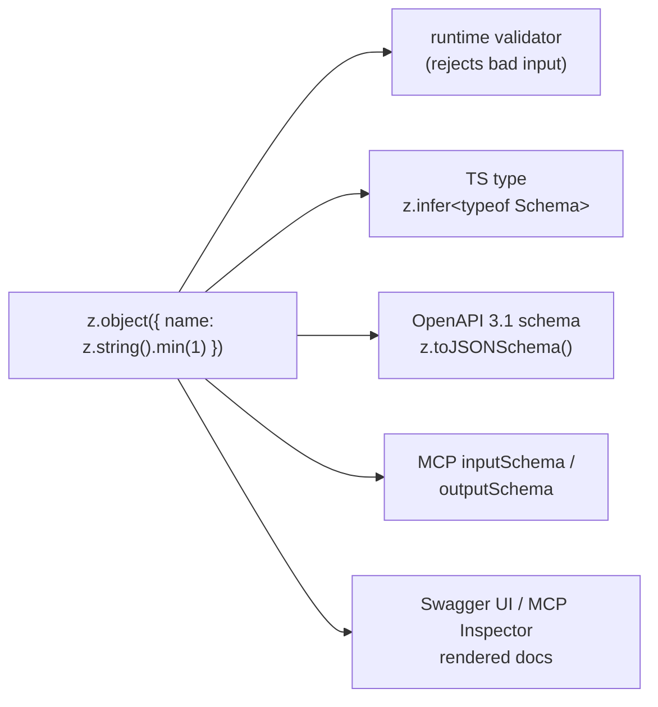

# Concept: Schema-first decorators

This is the idea that makes REST and MCP feel like the same framework: you
attach a **Zod schema to a decorator**, and that one schema becomes the runtime
validator, the TypeScript type of your handler's input, the OpenAPI/MCP
contract, and the rendered docs.

> Packages: [`@agentback/openapi`](../../packages/openapi) (REST verb
> decorators + OpenAPI emission) and [`@agentback/mcp`](../../packages/mcp)
> (`@tool`/`@resource`/`@prompt`). Both follow the same shape.

## One artifact, many views



There is no second source of truth. Change the schema and the handler's
parameter type changes (TS error if your code disagrees), the OpenAPI document
changes, the MCP tool definition changes, and the validation changes — together,
in one edit. This is the framework's core bet; the [design thesis](../agent-ergonomics.md)
explains why it matters so much for AI-led and large teams.

## REST: schemas on the verb decorator

```ts
import {z} from 'zod';
import {api, get, post} from '@agentback/openapi';

const HelloPath = z.object({name: z.string().min(1).max(64)});
const Greeting = z.object({greeting: z.string()});
const EchoIn = z.object({text: z.string().min(1).max(280)});
const EchoOut = z.object({echoed: z.string(), at: z.string()});

@api({basePath: '/greet'})
class GreetingController {
  @get('/hello/{name}', {path: HelloPath, response: Greeting})
  async hello(input: {path: z.infer<typeof HelloPath>}) {
    return {greeting: `Hello, ${input.path.name}!`};
  }

  @post('/echo', {body: EchoIn, response: EchoOut})
  async echo(input: {body: z.infer<typeof EchoIn>}) {
    return {echoed: input.body.text, at: new Date().toISOString()};
  }
}
```

The verb decorators (`@get`, `@post`, `@put`, `@patch`, `@del`) take a path and
an options object. The schema slots are:

| Option     | Validates                                | Appears in OpenAPI as                            |
| ---------- | ---------------------------------------- | ------------------------------------------------ |
| `path`     | URL path parameters                      | path parameters                                  |
| `query`    | query string                             | query parameters                                 |
| `headers`  | request headers (use **lowercase** keys) | header parameters                                |
| `body`     | request body                             | request body                                     |
| `response` | the handler's return value               | the `200` (or `status`) response                 |
| `status`   | — (a number)                             | overrides the default `200`; `204` sends no body |

## MCP: schemas on `@tool`

```ts
import {z} from 'zod';
import {mcpServer, tool} from '@agentback/mcp';

const ForecastIn = z.object({
  city: z.string(),
  days: z.number().int().min(1).max(7),
});
const ForecastOut = z.object({city: z.string(), forecast: z.string()});

@mcpServer()
class WeatherTools {
  @tool('get_forecast', {
    description: 'Forecast for a city',
    input: ForecastIn,
    output: ForecastOut,
  })
  async getForecast(input: z.infer<typeof ForecastIn>) {
    return {city: input.city, forecast: 'sunny'};
  }
}
```

`@tool`'s `input`/`output` play the same role as REST's `body`/`response`: the
input is validated and typed via `z.infer`; if `output` is declared, the return
type is constrained at compile time, validated at runtime, **and** handed to the
MCP SDK so structured-content clients consume it directly.

## The handler signature

This is the one rule worth memorizing, and it's identical in spirit for REST and
MCP.

### Slot 0 = the validated input bundle (when any schema is declared)

For **REST**, slot 0 is an object with only the keys you declared:

```ts
@post('/things/{id}', {path: IdPath, body: ThingBody, query: ThingQuery})
async create(input: {
  path: z.infer<typeof IdPath>;
  body: z.infer<typeof ThingBody>;
  query: z.infer<typeof ThingQuery>;
}) { … }
```

For **MCP**, slot 0 is the inferred input directly:

```ts
@tool('add', {input: AddIn})
async add(input: z.infer<typeof AddIn>) { … }
```

The decorator's typing enforces this at compile time. If your parameter type
disagrees with the declared schemas, you get a TypeScript error **at the
decorator line**, with the mismatch surfaced precisely.

### Slot 0 is yours when no schemas are declared

```ts
@get('/whoami')
async whoami(@inject(SecurityBindings.USER) user: UserProfile) { … } // valid

@tool('ping')
async ping() { … } // valid
```

### `@inject` lives at slot 1+

When you declare schemas, dependencies inject at the **second** parameter
onward — slot 0 is reserved for the input bundle:

```ts
@post('/echo', {body: EchoIn, response: EchoOut})
async echo(
  input: {body: z.infer<typeof EchoIn>},        // slot 0
  @inject('services.Clock') clock: Clock,        // slot 1+
) {
  return {echoed: input.body.text, at: clock.now()};
}
```

Putting `@inject` at slot 0 _alongside_ a schema throws at decoration time with
the offending class+method named.

## Validation, in and out

- **Input** is parsed with the schema before your handler runs. On failure the
  request never reaches your code:
  - REST returns **422** (bad body) / **400** (bad params) with the structured
    `ZodError.issues` in the response.
  - MCP throws, and the call surfaces the issues to the client.
- **Output** is validated against `response`/`output` after your handler
  returns. On mismatch: REST logs it (and still responds), MCP throws — the
  asymmetry is intentional (a REST API shouldn't 500 on a doc drift, an MCP tool
  contract should be strict).

## Startup checks

Some coherence is verified when `app.start()` runs, not at request time:

- **URL placeholders must match the `path` schema keys.** `@get('/hello/{name}',
{path: z.object({name: …})})` is fine; a `{id}` in the URL with no `id` in the
  schema throws at startup, naming the controller + method.

This turns a class of "wrong at runtime, in production" bugs into "wrong at
boot, in the first test."

## Where it's wired (for the curious)

- REST verb decorators store route options on `RestEndpoint` metadata plus a
  per-route Zod bundle in `zod-bridge.ts`'s `routeRegistry`. `RestServer`
  reads the registry, validates, and weaves `@inject` arguments via
  `resolveInjectedArguments`.
- `@tool` stores `input`/`output` on `ToolMetadata`. `MCPServer.dispatchTool`
  parses input, weaves injects, applies the method, validates output.

You don't need to touch those to use the framework, but it's a short read if you
want to extend the dispatcher — see
[Composition & extensibility](../guides/composition-and-extensibility.md#subclassing-the-dispatcher).

## Next

- [Components, servers & lifecycle](components-servers-lifecycle.md)
- [Build a REST API](../guides/build-a-rest-api.md) /
  [Build an MCP server](../guides/build-an-mcp-server.md)
