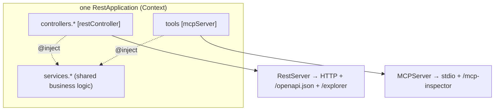

# Guide: Build a hybrid app (REST + MCP)

The payoff of "servers are components over one container": run a **REST API and
an MCP server in the same process**, often backed by the **same Zod schemas and
the same services**. One business rule, two surfaces — an HTTP endpoint for apps
and an MCP tool for agents — with no duplicated logic.

> Working examples: [`examples/hello-hybrid`](../../examples/hello-hybrid)
> (`pnpm -F hello-hybrid start`) and [`examples/hello-client`](../../examples/hello-client).

## One process, two servers

```ts
import {RestApplication} from '@agentback/rest';
import {MCPComponent} from '@agentback/mcp';

const app = new RestApplication(); // binds servers.RestServer
app.component(MCPComponent); // binds servers.MCPServer

app.restController(GreetingController); // REST surface
app.service(EchoTools); // MCP surface (an MCP_SERVERS extension)

app.configure('servers.RestServer').to({port: 3000});
app.configure('servers.MCPServer').to({name: 'hello-hybrid', version: '1.0.0'});

await app.start(); // BOTH servers start; each discovers its own bindings by tag
```

`app.start()` walks the lifecycle and starts every `servers.*` binding. The REST
server finds `restController`-tagged bindings; the MCP server finds
`mcpServer`-tagged ones. They share the container, so they also share any service
you bind.



## Share logic, not just process

Put the real work in a service and inject it into both a controller and a tool.
The HTTP route and the MCP tool become thin adapters over one implementation:

```ts
@injectable({scope: BindingScope.SINGLETON})
class Forecaster {
  forecast(city: string) {
    return {city, forecast: 'sunny'};
  }
}

@api({basePath: '/weather'})
class WeatherController {
  constructor(@inject('services.Forecaster') private fc: Forecaster) {}
  @get('/{city}', {path: CityPath, response: Forecast})
  async get(input: {path: {city: string}}) {
    return this.fc.forecast(input.path.city);
  }
}

@mcpServer()
class WeatherTools {
  constructor(@inject('services.Forecaster') private fc: Forecaster) {}
  @tool('forecast', {input: CityIn, output: Forecast})
  forecast(input: {city: string}) {
    return this.fc.forecast(input.city);
  }
}
```

Both can even reuse the **same response schema** (`Forecast`) — REST validates it
as an HTTP response, MCP validates it as tool output. One artifact, two
boundaries; see [Schema-first decorators](../concepts/schema-first-decorators.md).

## Mount both UIs

```ts
import {installExplorer} from '@agentback/rest-explorer';
import {installInspector} from '@agentback/mcp-inspector';

await installExplorer(app, {title: 'Hybrid REST'}); // /explorer
await installInspector(app, {title: 'Hybrid MCP'}); // /mcp-inspector
await app.start();
```

Now `/explorer` browses the REST API and `/mcp-inspector` exercises the tools —
both served by the same process.

## A type-safe client with no codegen

Because the contract _is_ the Zod schema, a TypeScript consumer can import the
exact same schemas and get a fully typed client with **no generated SDK and no
spec round-trip** — [`@agentback/client`](../../packages/client).

### Share the schemas

Keep schemas in a module the server and client both import. In a monorepo,
export them from the server package (e.g. `hello-rest/schemas`) — but **never
from the server's main entry**, or importing the schemas would also boot the
server.

```ts
// schemas.ts — imported by server controllers AND client route handles
export const HelloPath = z.object({name: z.string().min(1)});
export const Greeting = z.object({greeting: z.string()});
```

### Define route handles

```ts
import {createClient, routeGroup} from '@agentback/client';
import {Greeting, HelloPath, EchoIn, EchoOut} from 'hello-rest/schemas';

const greet = routeGroup('/greet');
const hello = greet.get('/hello/{name}', {path: HelloPath, response: Greeting});
const echo = greet.post('/echo', {body: EchoIn, response: EchoOut});

const client = createClient({baseURL: 'http://localhost:3000'});

const out = await hello.call(client, {path: {name: 'Alice'}});
//    ^^^ inferred {greeting: string}, validated against Greeting at runtime
```

- `route.call(client, input)` — throws on non-2xx; returns the validated body.
- `route.safeCall(client, input)` — returns a discriminated `{success, ...}`
  result (mirrors Zod's `safeParse`) for when a non-2xx is an expected path.
- `route.url(client, input)` — composes the URL without firing a request.

### Authenticated calls

The `headers` option is a (possibly async) function, so token refresh is natural:

```ts
const {token} = await login.call(anon, {
  body: {username: 'alice', roles: ['admin']},
});
const authed = createClient({
  baseURL,
  headers: () => ({authorization: `Bearer ${token}`}),
});
await me.call(authed); // sends the bearer token
```

Drift is caught at the **call site**: change a shared schema and TypeScript flags
every client call that no longer matches — no regeneration step. (Non-TypeScript
consumers still get `/openapi.json` for standard codegen.)

## When to go hybrid

Reach for one process serving both when:

- The same domain logic should be reachable by both apps (HTTP) and agents (MCP).
- You want a single deploy unit, config, and auth story.

Keep them separate when the surfaces have independent scaling, security
boundaries, or release cadences — the framework supports both; it's a binding/
component decision, not a rewrite.

## Next

- [Composition & extensibility](composition-and-extensibility.md) — bundle these
  surfaces into reusable components and add cross-cutting behavior.
- [Architecture overview](../architecture/overview.md) — how dispatch and
  discovery actually work under the hood.
