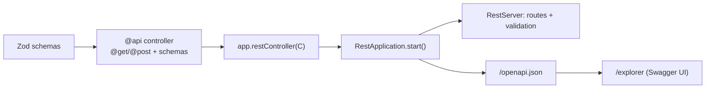

# Guide: Build a REST API

Build a Zod-validated REST service that auto-emits OpenAPI 3.1 and serves
Swagger UI. By the end you'll have controllers, validation, dependency
injection, auth, and a browsable spec.

> Prerequisites: skim [Dependency injection](../concepts/dependency-injection.md)
> and [Schema-first decorators](../concepts/schema-first-decorators.md).
> Working example: [`examples/hello-rest`](../../examples/hello-rest) —
> `pnpm -F hello-rest start`.

## 1. Schemas first

Define your shapes as Zod schemas in one place and share them. (Keeping schemas
in their own module lets a [typed client](build-a-hybrid-app.md#a-type-safe-client-with-no-codegen)
import the exact same objects.)

```ts
// schemas.ts
import {z} from 'zod';

export const HelloPath = z.object({name: z.string().min(1).max(64)});
export const Greeting = z.object({greeting: z.string()});
export const EchoIn = z.object({text: z.string().min(1).max(280)});
export const EchoOut = z.object({echoed: z.string(), at: z.string()});
```

## 2. A controller

A controller is a plain class. `@api({basePath})` sets a shared prefix; each
method gets a verb decorator carrying its schemas. The handler receives the
validated [input bundle in slot 0](../concepts/schema-first-decorators.md#the-handler-signature).

```ts
import {z} from 'zod';
import {api, get, post} from '@agentback/openapi';
import {EchoIn, EchoOut, Greeting, HelloPath} from './schemas.js';

@api({basePath: '/greet'})
export class GreetingController {
  @get('/hello/{name}', {path: HelloPath, response: Greeting})
  async hello(input: {
    path: z.infer<typeof HelloPath>;
  }): Promise<z.infer<typeof Greeting>> {
    return {greeting: `Hello, ${input.path.name}!`};
  }

  @post('/echo', {body: EchoIn, response: EchoOut, description: 'Echoed input'})
  async echo(input: {
    body: z.infer<typeof EchoIn>;
  }): Promise<z.infer<typeof EchoOut>> {
    return {echoed: input.body.text, at: new Date().toISOString()};
  }
}
```

What you get for free:

- `GET /greet/hello/world` → `{"greeting":"Hello, world!"}`.
- `POST /greet/echo` with `{"text":""}` → **422** with the Zod issues.
- `GET /openapi.json` → an OpenAPI 3.1.1 document derived from these schemas.

## 3. Start the server

`RestApplication` binds `servers.RestServer` for you. Register the controller,
configure a port, start.

```ts
import {RestApplication} from '@agentback/rest';
import {GreetingController} from './greeting.controller.js';

const app = new RestApplication();
app.configure('servers.RestServer').to({port: 3000, host: '127.0.0.1'});
app.restController(GreetingController);
await app.start();

const server = await app.restServer;
console.log(`listening at ${server.url}`);
```

`port: 0` picks a free port (handy for tests — read it back from `server.url`).

## 4. Inject dependencies into handlers

Declare a dependency at slot 1+ (slot 0 is the input bundle). The container
resolves it per the binding's scope.

```ts
import {inject} from '@agentback/core';

@post('/echo', {body: EchoIn, response: EchoOut})
async echo(
  input: {body: z.infer<typeof EchoIn>},
  @inject('services.Clock') clock: {now(): string},
) {
  return {echoed: input.body.text, at: clock.now()};
}
```

Bind it once: `app.bind('services.Clock').to({now: () => new Date().toISOString()})`.
For tests, rebind to a fake — no mocking framework needed.

## 5. Add authentication & authorization

The auth stack is components. Add JWT auth, then gate methods with
`@authenticate` and `@authorize`.

```ts
import {authenticate} from '@agentback/authentication';
import {authorize} from '@agentback/authorization';
import {
  JWTAuthenticationComponent,
  JWTBindings,
} from '@agentback/authentication-jwt';
import {
  SecurityBindings,
  UserProfile,
  securityId,
} from '@agentback/security';

// wiring (before start)
app.bind(JWTBindings.SECRET).to(process.env.JWT_SECRET ?? 'dev-secret');
app.bind(JWTBindings.EXPIRES_IN).to('1h');
app.component(JWTAuthenticationComponent);

@api({basePath: '/auth'})
class AuthController {
  // any authenticated user
  @authenticate('jwt')
  @get('/me', {response: Me})
  async me(
    @inject(SecurityBindings.USER) user: UserProfile,
  ): Promise<z.infer<typeof Me>> {
    return {
      id: user[securityId],
      name: user.name ?? '',
      roles: (user as any).roles ?? [],
    };
  }

  // authenticated AND has the 'admin' role
  @authenticate('jwt')
  @authorize({allowedRoles: ['admin']})
  @get('/secret', {response: Secret})
  async secret(): Promise<z.infer<typeof Secret>> {
    return {secret: '🐇 deeper.'};
  }
}
```

Note `@get('/me')` declares no input schema, so slot 0 is free for `@inject` —
see [the handler signature rules](../concepts/schema-first-decorators.md#the-handler-signature).

## 6. Browse it: Swagger UI

```ts
import {installExplorer} from '@agentback/rest-explorer';

await installExplorer(app, {title: 'My API'}); // before app.start()
// -> Swagger UI at /explorer, pointed at /openapi.json
```

Want to see the DI container itself? Mount the
[Context Explorer](composition-and-extensibility.md#inspect-the-container):
`installContextExplorer(app)` → `/context-explorer/`.

## 7. Observability (optional)

Health checks and Prometheus metrics are one-liners:

```ts
import {
  installHealth,
  registerHealthCheck,
} from '@agentback/extension-health';
import {installMetrics} from '@agentback/extension-metrics';

registerHealthCheck(app, 'health.checks.db', {
  name: 'db',
  type: 'readiness',
  async check() {
    /* throw to report unhealthy */
  },
});
await installHealth(app); // GET /health, /ready
await installMetrics(app); // GET /metrics
```

## Customizing requests

You don't reach for sequences/actions (the framework deliberately dropped them).
Instead:

- **Per-route** behavior → it's on the decorator (schemas, status, description).
- **Cross-cutting** behavior (CORS, rate limit, auth probes, tracing) →
  [middleware or interceptors](composition-and-extensibility.md).
- **Envelope/error-shape changes** → subclass `RestServer` and override
  `dispatch` / `sendResult` / `sendError`
  ([how](composition-and-extensibility.md#subclassing-the-dispatcher)).

CORS is built in — configure it on the REST server:
`app.configure('servers.RestServer').to({cors: true})` (or pass a `CorsOptions`
object from the `cors` package for fine control).

## Recap



## Next

- [Build an MCP server](build-an-mcp-server.md) — the same shape, for tools.
- [Build a hybrid app](build-a-hybrid-app.md) — REST + MCP together, one schema set.
- [Composition & extensibility](composition-and-extensibility.md) — middleware,
  interceptors, custom dispatch.
