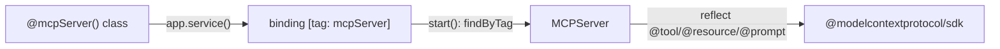

# Guide: Build an MCP server

Expose tools, resources, and prompts that an MCP client — Claude Desktop, the
Vercel AI SDK, your own agent — can discover and call. It's the same
decorator-on-a-class, schema-on-the-decorator shape as REST, so if you've read
the [REST guide](build-a-rest-api.md) this will feel familiar.

> Package: [`@agentback/mcp`](../../packages/mcp). Built on the official
> [`@modelcontextprotocol/sdk`](https://github.com/modelcontextprotocol).
> Working examples: [`examples/hello-mcp`](../../examples/hello-mcp) (stdio) and
> [`examples/hello-hybrid`](../../examples/hello-hybrid) (REST + MCP).

## What MCP exposes

| Primitive    | Decorator                      | An LLM uses it to…                                 |
| ------------ | ------------------------------ | -------------------------------------------------- |
| **Tool**     | `@tool(name, {input, output})` | _do_ something (call a function with typed args).  |
| **Resource** | `@resource(uri, {...})`        | _read_ context (a document/blob addressed by URI). |
| **Prompt**   | `@prompt(name, {...})`         | fetch a reusable prompt template.                  |

A class tagged `@mcpServer()` groups these; the `MCPServer` discovers them and
registers them with the SDK.

## 1. A tool class

```ts
import {z} from 'zod';
import {mcpServer, tool} from '@agentback/mcp';

const EchoIn = z.object({text: z.string().min(1)});
const AddIn = z.object({a: z.number().int(), b: z.number().int()});
const AddOut = z.object({sum: z.number().int()});

@mcpServer()
export class MathTools {
  @tool('echo', {description: 'Echo back the text', input: EchoIn})
  echo(input: z.infer<typeof EchoIn>) {
    return {echoed: input.text};
  }

  @tool('add', {description: 'Add two integers', input: AddIn, output: AddOut})
  add(input: z.infer<typeof AddIn>): z.infer<typeof AddOut> {
    return {sum: input.a + input.b};
  }
}
```

`input` is validated and typed via `z.infer`. Declaring `output` constrains the
return type at compile time, validates it at runtime, and hands the schema to
the MCP SDK so structured-content clients consume it directly. Omit `output` to
leave the return type free.

## 2. Resources and prompts

In this framework, resources and prompts are **parameterless** methods — the
handler takes no input and returns a value the framework wraps into the MCP wire
shape.

```ts
import {resource, prompt} from '@agentback/mcp';

@mcpServer()
export class Docs {
  @resource('docs://motd', {
    name: 'motd',
    description: 'Message of the day',
    mimeType: 'text/plain',
  })
  motd() {
    return 'Welcome to the service.'; // → {contents: [{uri, mimeType, text}]}
  }

  @prompt('triage', {description: 'Triage a bug report'})
  triage() {
    return 'You are a triage assistant. Classify the report by severity…';
    // → {messages: [{role: 'user', content: {type: 'text', text}}]}
  }
}
```

A `string` return is sent as text; a non-string is JSON-stringified.

## 3. Run the server

Add `MCPComponent` (it binds `servers.MCPServer`), register your classes with
`app.service(...)`, configure, start. The stdio transport is active by default —
exactly what Claude Desktop and most local MCP clients speak.

```ts
import {RestApplication} from '@agentback/rest';
import {MCPComponent} from '@agentback/mcp';
import {MathTools, Docs} from './tools.js';

const app = new RestApplication();
app.component(MCPComponent);
app.configure('servers.MCPServer').to({
  name: 'my-mcp',
  version: '1.0.0',
  // transports: {stdio: true},  // default; set false in tests/hybrid HTTP apps
});
app.service(MathTools);
app.service(Docs);
await app.start(); // MCP server up, tools/resources/prompts registered
```

> You can use a plain `Application` instead of `RestApplication` if you only
> want MCP and no HTTP. `RestApplication` is convenient when you also want the
> [inspector UI](#5-inspect-it-the-mcp-inspector) (which is served over HTTP).

## Expose it over Streamable HTTP

stdio is great for a local child process, but to let **remote** MCP clients
(Claude, Cursor, agents) reach the same tools, expose the in-process server over
the MCP **Streamable HTTP** transport with
[`@agentback/mcp-http`](../../packages/mcp-http):

```ts
import {installMcpHttp} from '@agentback/mcp-http';

await installMcpHttp(app); // before app.start() — mounts POST/GET/DELETE /mcp
```

Each client session gets its own isolated server instance (keyed by the
`Mcp-Session-Id` header). A client connects with the SDK's
`StreamableHTTPClientTransport`:

```ts
import {Client} from '@modelcontextprotocol/sdk/client/index.js';
import {StreamableHTTPClientTransport} from '@modelcontextprotocol/sdk/client/streamableHttp.js';

const client = new Client({name: 'my-client', version: '1.0.0'});
await client.connect(
  new StreamableHTTPClientTransport(new URL('http://host:port/mcp')),
);
await client.callTool({name: 'add', arguments: {a: 2, b: 40}});
```

This works alongside REST in one process (`examples/hello-hybrid` mounts `/mcp`,
`/explorer`, and `/mcp-inspector` together). To protect `/mcp` as an OAuth 2.1
resource server, pass `installMcpHttp(app, {auth: {...}})` — see the
[`@agentback/mcp-http` README](../../packages/mcp-http/README.md#oauth-resource-server).
Tag a tool with `@tool('x', {scope: 'admin'})` to gate it by the caller's token
scopes.

## How discovery works

`@mcpServer()` is sugar for `@bind({tags: {mcpServer: true}})`. When you call
`app.service(MathTools)`, the framework reads that bind metadata and tags the
binding `mcpServer` automatically — **you never call `.tag()`**. At
`app.start()`, `MCPServer` queries the container for `mcpServer`-tagged
bindings, reflects over their `@tool`/`@resource`/`@prompt` methods, and
registers each with the SDK.



Consequence: adding a tool is adding a method (or a class + `app.service`).
Nothing central changes — the same composability as REST controllers.

## 4. Dependency injection in tools

Tools are DI-resolved classes, so inject services like anywhere else. With an
`input` schema, injects go at slot 1+ (slot 0 is the validated input); with no
input, slot 0 is free.

```ts
@mcpServer()
class WeatherTools {
  constructor(@inject('services.WeatherApi') private api: WeatherApi) {}

  @tool('forecast', {input: z.object({city: z.string()})})
  async forecast(input: {city: string}) {
    return this.api.lookup(input.city);
  }
}
```

## 5. Inspect it: the MCP Inspector

A browser UI to list and _exercise_ tools/resources/prompts without wiring up an
MCP client:

```ts
import {installInspector} from '@agentback/mcp-inspector';

await installInspector(app); // before app.start(); needs servers.MCPServer bound
// -> UI at /mcp-inspector/, JSON API at /mcp-inspector/api/*
```

The inspector fills tool argument forms from each tool's Zod-derived JSON Schema,
shows validation errors inline, renders results, and logs a call history. (It's
itself a worked example of a dogfooded REST controller — see its
[README](../../packages/mcp-inspector/README.md).)

## Calling tools programmatically

`MCPServer` exposes the same dispatch path the SDK uses, handy for tests or
in-process use:

```ts
const mcp = await app.get<MCPServer>('servers.MCPServer');
await mcp.callTool('add', {a: 2, b: 40}); // → {sum: 42}
await mcp.readResource('motd'); // → {contents: [...]}
await mcp.getPrompt('triage'); // → {messages: [...]}
```

Invalid input throws with the structured Zod issues attached.

## Testing an MCP server

[`examples/hello-mcp`](../../examples/hello-mcp) drives the server with a real
MCP client over stdio (`transports: {stdio: true}` and an in-memory client
pair). For unit-style checks, prefer `callTool`/`readResource`/`getPrompt`
against an app with `transports: {stdio: false}` so the server doesn't take over
the process's stdin.

## Next

- [Build a hybrid app](build-a-hybrid-app.md) — serve REST and MCP from one
  process, sharing the same schemas.
- [Composition & extensibility](composition-and-extensibility.md) — package
  your tools as a reusable component.
