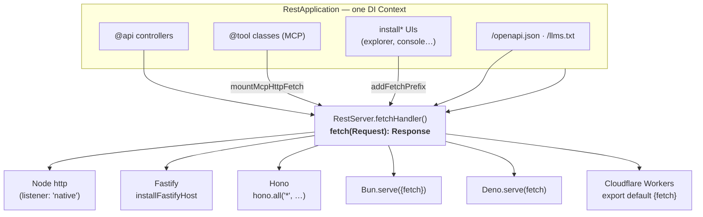
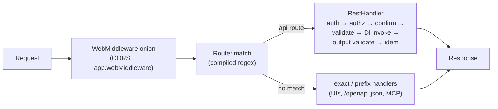

# HTTP hosts: Node, Fastify, Hono, Bun, Deno, Workers

AgentBack's REST **and** MCP surfaces run on any runtime with a
`fetch(Request): Response` entry point — not just Node/Express.
`RestServer.fetchHandler()` returns the same routing + Zod validation + DI +
auth + dispatch hooks + confirmation/idempotency + streaming + uploads +
error-envelope pipeline as the Express server, as a runtime-neutral handler.
One app, hosted by whatever owns the port.

> A polished, standalone version of this diagram lives at
> [`../architecture/diagrams/http-hosts.html`](../architecture/diagrams/http-hosts.html)
> — open it in a browser (with Copy / PNG / PDF export).



> **Status:** the fetch path is at **parity** with the Express path — `@api`
> routes (incl. streaming + uploads), authentication/authorization, dispatch
> hooks, confirmation/idempotency, the `/openapi.json` + `/llms.txt` documents,
> the `install*` UIs, and **MCP-over-HTTP** (via `mountMcpHttpFetch`, incl. OAuth
> bearer + strategy auth). The runnable comparison is
> [`examples/hello-hosts`](../../examples/hello-hosts/README.md). The Express
> listener remains the default; `rest.listener: 'native'` opts into the
> fetch-driven Node listener. See the
> [root-cutover spec](../superpowers/specs/2026-06-16-fetch-seam-root-cutover.md)
> for what stays Express-only (raw `@inject(HTTP_REQUEST/HTTP_RESPONSE)` routes
> and dispatch-seam subclasses).

## The handler

```ts
import {RestApplication} from '@agentback/rest';

const app = new RestApplication({rest: {listen: false}}); // no TCP listener
app.restController(MyController);
await app.start();                                         // mounts routes
const server = await app.getServer('RestServer');
export const fetchHandler = server.fetchHandler();         // {fetch}
```

`listen: false` makes `start()` wire every route but bind no port — the runtime
owns the listener. `fetchHandler()` is also exposed in tests via
`createTestApp(App).fetch(...)` (no socket needed).

## How a request flows on the fetch path



The same `RestHandler` runs whether the host is Node, Bun, Fastify, or a Worker —
only the outer adapter (Node↔Web bridge) differs.

## Native (no host framework)

`rest.listener: 'native'` serves `fetchHandler()` through a Node `http` server
directly — no Express in the request path. The runtime-neutral Router is the
single source of truth.

```ts
const app = new RestApplication({rest: {listener: 'native'}});
app.restController(MyController);
await app.start();   // binds http.createServer(createNodeListener(fetchHandler()))
```

`start()` throws if a route opts into Express semantics (raw req/res injection or
a dispatch-seam subclass) — those need the default `'express'` listener.

## Fastify

```ts
import Fastify from 'fastify';
import {installFastifyHost} from '@agentback/rest';

const app = new RestApplication({rest: {listen: false}});
app.restController(MyController);
await app.start();
const server = await app.getServer('RestServer');

const fastify = Fastify();
fastify.get('/native', async () => ({from: 'fastify'})); // Fastify-native route
installFastifyHost(fastify, server.fetchHandler());       // non-greedy fallback
await fastify.listen({port: 3000});
```

`installFastifyHost` mounts AgentBack as a **non-greedy fallback** (a wildcard
route inside an encapsulated plugin scope), so any Fastify-native route or plugin
front-runs it. `fastify` is a peer/dev dependency — never a hard runtime dep.

## Hono

```ts
import {Hono} from 'hono';
import {serve} from '@hono/node-server'; // or Bun.serve / Deno.serve

const hono = new Hono();
hono.get('/native', c => c.json({from: 'hono'})); // Hono-native route, runs first
hono.all('*', c => fetchHandler.fetch(c.req.raw)); // everything else → AgentBack
serve({fetch: hono.fetch, port: 3000});
```

`c.req.raw` is the underlying WHATWG `Request` — exactly what `fetchHandler`
expects.

## Bun

```ts
Bun.serve({port: 3000, fetch: fetchHandler.fetch});
```

Bun's server *is* a fetch host — no adapter, no `@hono/node-server`. Its `fetch`
field IS the `FetchHost` interface.

## Deno

```ts
Deno.serve({port: 3000}, fetchHandler.fetch);
```

## Cloudflare Workers

> **Use `EdgeRestApplication`.** It is the fetch/edge host: pinned to
> `listener: 'native'` (so `start()` mounts no Express), and its dependency
> closure contains **no `express`/`cors`** — `npm install` of an
> `EdgeRestApplication` app pulls neither the express runtime nor the package.
> `RestApplication` (a.k.a. `ExpressRestApplication`) is the Node/Express host;
> on a Worker it would try to load the Node-only `express` runtime and throw.

```ts
import {EdgeRestApplication} from '@agentback/rest';

// Build on the FIRST REQUEST, not at module scope. Constructing the app runs
// the DI container's ID generator, and Workers forbid generating random values
// during global evaluation — a module-scope `new EdgeRestApplication()` throws
// at startup. The cached promise means only the first request pays cold-start.
let booted: Promise<{fetch(req: Request): Promise<Response>}> | undefined;
const host = () =>
  (booted ??= (async () => {
    const app = new EdgeRestApplication({rest: {listen: false}});
    app.restController(MyController);
    await app.start();                   // collects routes; mounts NO Express
    const server = await app.getServer('RestServer');
    return server.fetchHandler();
  })());

export default {
  async fetch(request: Request): Promise<Response> {
    return (await host()).fetch(request);
  },
};
```

This is exactly the wrapper `agentback deploy cloudflare` generates. Construction
is deferred into `fetch()` because Workers reject randomness/IO at global scope
(see the constraints below); the cached `booted` promise means subsequent
requests reuse the handler. On Workers, `FileStore` should be R2 and any
Node-only deps must be avoided in the route handlers.

`EdgeRestApplication` deliberately omits `app.middleware`/`app.expressMiddleware`
(Express-only) — use `app.webMiddleware` for the runtime-neutral chain. It
supports `@api` routes, `/openapi.json`, `/llms.txt`, and MCP-over-fetch; the
`install*` UIs (console/explorers) are Express-host-only for now.

Two edge-runtime constraints the **bundle doctor cannot catch** (it is a *static*
analyzer — bundle-clean ≠ runtime-clean), already handled by the framework but
worth knowing if you author module-scope code:

- **No "generate random values" / IO / timers in the global (module-load) scope** —
  Workers reject it at startup validation. Generate IDs *inside* handlers (the
  framework's `generateUniqueId` and `crypto.randomUUID()` are call-time safe).
- **`nodejs_compat` fakes `process.versions.node`** — don't gate "am I on Node?"
  on that alone; also check `import.meta.url` is a `file:` URL.

## MCP-over-HTTP on any host

`installMcpHttp(app)` auto-selects the transport for the host: in
`listener: 'native'` it mounts the fetch-native
`mountMcpHttpFetch` (the SDK's `WebStandardStreamableHTTPServerTransport`);
otherwise the Express transport. Either way, the same `@tool`/`@resource` surface
is reachable by remote MCP clients, with OAuth bearer or strategy auth.

```ts
import {installMcpHttp} from '@agentback/mcp-http';

const app = new RestApplication({rest: {listener: 'native'}});
app.component(MCPComponent);
app.service(MyTools);
await installMcpHttp(app);   // POST/GET/DELETE /mcp on the fetch path
await app.start();
```

To drive it on Bun/Fastify/Hono (where you own the listener), call
`mountMcpHttpFetch(mcp, server, options)` before `app.start()`, then host
`server.fetchHandler()` as above.

## Testing the handler in-process

No socket needed — `createTestApp` exposes a `fetch` client over the same
handler:

```ts
const t = await createTestApp(App);
const res = await t.fetch('/greet/Ada');
expect(res.status).toBe(200);
```

## One handler, every runtime

Node, Fastify, Hono, Bun, Deno, and Workers all take the same
`fetch(Request): Promise<Response>`, so each deployment is a thin wrapper around
the one `fetchHandler`. The Zod schemas, OpenAPI, MCP projection, auth, and error
envelopes are identical wherever it runs.

## Deploying to Cloudflare Workers with the CLI

The `agentback deploy cloudflare` command automates the full deploy pipeline:

1. **Generate** — writes `.agentback/deploy/cloudflare/worker.ts` (a thin fetch-handler wrapper around `buildApp`) and merges `wrangler.toml`.
2. **Preflight** — runs the bundle doctor: esbuild-bundles the generated worker and checks for denied `node:` imports (`node:fs`, `node:fs/promises`, `node:net`, …) that the Workers runtime rejects. The fetch path of `@agentback/rest` is edge-safe; `fromDisk`/`serveStaticDir` (which pull `node:fs`) tree-shake away unless your app actually imports them, so a REST-only app passes. **Note:** the doctor is *static* — passing it proves the bundle is clean, **not** that the worker runs. Use `listener: 'native'` (below) and a real deploy to confirm runtime behavior.
3. **Deploy** — calls `wrangler deploy` and parses the `*.workers.dev` URL from the output.
4. **Verify** — HTTP-GETs `/openapi.json` on the live worker to confirm the deployment is serving correctly.

> Your `buildApp` must construct an **`EdgeRestApplication`** (or a
> `RestApplication` with `rest: {listener: 'native'}`) — the Express-host default
> throws at startup on a Worker (see the Cloudflare Workers section above).

```bash
# Install prerequisites
npm install -g wrangler
wrangler login

# Build your app, then deploy
pnpm build
agentback deploy cloudflare --prod
```

The `--dry-run` flag stops after preflight (no `wrangler` invocation), useful in CI to validate that the bundle is Workers-compatible without spending a deploy.

```bash
agentback deploy cloudflare --dry-run
```

To inspect the generated files before deploying (eject mode):

```bash
agentback deploy cloudflare --eject
# Inspect .agentback/deploy/cloudflare/worker.ts and wrangler.toml, then:
wrangler deploy
```

## Deploying the Express host to a serverless platform (Vercel)

`agentback deploy vercel` targets a Node serverless function and hands the
platform your **Express** app, so it's the Node/Express host (not the edge
path). Two things to know:

- **Declare `express` + `cors` (and `multer` if you use uploads) in your app's
  `dependencies`** — they are optional peer deps of `@agentback/rest` (see the
  v0.5.0 release notes), so they are not installed transitively.
- **Static-import them in the function entry.** `@agentback/rest` loads
  express/cors lazily via `createRequire` (to keep edge builds Express-free),
  which serverless bundlers (Vercel's `node-file-trace`) **cannot follow** — so
  the deployed function omits them and crashes with `Cannot find module 'cors'`.
  The generated entry (`agentback deploy vercel`) already includes
  `import 'express'; import 'cors';` for this reason; if you hand-write the
  function or use a different platform, add those side-effect imports yourself.
