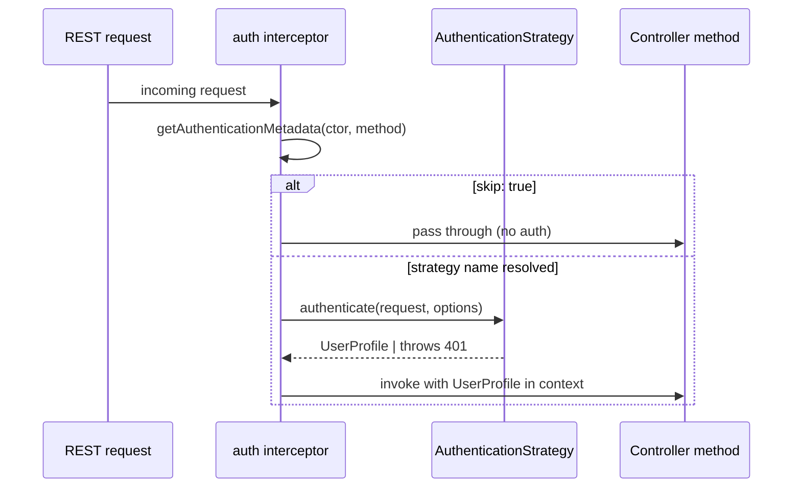

# @agentback/authentication

> `@authenticate` decorator + `AuthenticationStrategy` interface — minimal ESM
> port of `@loopback/authentication`, no `@loopback/repository` dependencies.

Provides the decorator that marks controller classes and methods as requiring
authentication, the strategy interface that concrete implementations satisfy,
and the resolver that the REST interceptor uses to locate the right strategy at
request time. The package is strategy-agnostic; ship one or more strategy
packages (e.g. `@agentback/authentication-jwt`) alongside it.

```bash
pnpm add @agentback/authentication
```

## What it provides

| Export                                    | Kind               | Purpose                                                                                                      |
| ----------------------------------------- | ------------------ | ------------------------------------------------------------------------------------------------------------ |
| `authenticate(strategy, opts?)`           | decorator          | Mark a class or method as requiring auth; `authenticate.skip()` bypasses class-level auth on a single method |
| `AuthenticationStrategy`                  | interface          | Contract for strategy implementations: `name` + `authenticate(req, opts?)`                                   |
| `AuthenticationMetadata`                  | interface          | Shape stored by the decorator: `strategy`, `options`, `skip`                                                 |
| `AuthenticateFn`                          | type               | `(request) => Promise<UserProfile \| undefined>` — used by the REST interceptor                              |
| `AuthenticationBindings.AUTH_STRATEGY`    | tag string         | Bind strategies with this tag so the resolver discovers them by `findByTag`                                  |
| `AuthenticationBindings.CURRENT_STRATEGY` | `BindingKey`       | Per-request resolved strategy (used by advanced interceptors)                                                |
| `AuthenticationKeys.METADATA`             | `MetadataAccessor` | Metadata reflection key (method-level)                                                                       |
| `AuthenticationKeys.CLASS_METADATA`       | `MetadataAccessor` | Metadata reflection key (class-level)                                                                        |
| `getAuthenticationMetadata(ctor, method)` | function           | Read effective metadata — method wins over class                                                             |
| `resolveStrategy(context, name)`          | function           | Locate a bound strategy by name from the DI context                                                          |
| `AnonymousAuthenticationStrategy`         | strategy           | `name: 'anonymous'` — never throws; returns `ANONYMOUS_USER`                                                 |
| `ANONYMOUS_USER`                          | `UserProfile`      | Sentinel for a known-but-unauthenticated request                                                             |
| `ApiKeyAuthenticationStrategy`            | strategy           | `name: 'api-key'` — reads `x-api-key`/`?apiKey`, delegates to a verifier                                     |
| `ApiKeyVerifier`                          | type               | `(apiKey, request) => UserProfile \| undefined`                                                              |
| `API_KEY_VERIFIER`                        | `BindingKey`       | Bind your `ApiKeyVerifier` here to enable the API-key strategy                                               |
| `ClientCredentialsAuthenticationStrategy` | strategy           | `name: 'client-credentials'` — `client_id`/`client_secret` headers or Basic auth → `ClientApplication`       |
| `ClientCredentialsVerifier`               | type               | `(clientId, clientSecret, request) => ClientApplication \| undefined`                                        |
| `CLIENT_CREDENTIALS_VERIFIER`             | `BindingKey`       | Bind your verifier here to enable the client-credentials strategy                                            |
| `AuthenticationResult`                    | type               | `{user?, clientApplication?}` — a strategy may return this instead of a bare `UserProfile`                   |
| `normalizeAuthResult(raw)`                | function           | Coerce a strategy's return into an `AuthenticationResult` (used by `rest`)                                   |

## Built-in strategies

Two generic, dependency-free strategies ship with the package (a concrete JWT
strategy lives in `@agentback/authentication-jwt`):

```ts
import {securityId} from '@agentback/security';
import {
  AnonymousAuthenticationStrategy,
  ApiKeyAuthenticationStrategy,
  API_KEY_VERIFIER,
} from '@agentback/authentication';

// API key: bind a verifier, then register the strategy.
app
  .bind(API_KEY_VERIFIER)
  .to(async key =>
    key === process.env.API_KEY
      ? {[securityId]: 'svc', name: 'svc'}
      : undefined,
  );
app.service(ApiKeyAuthenticationStrategy); // bound with the AUTH_STRATEGY tag

// Anonymous: a non-throwing fallback for public / optional-auth routes.
app.service(AnonymousAuthenticationStrategy);

class PublicController {
  @authenticate('anonymous') // handler still runs, with ANONYMOUS_USER in context
  @get('/status')
  status() {
    return {ok: true};
  }
}
```

The **client-credentials** strategy authenticates a _calling application_ (not a
user) and resolves it to a `ClientApplication`. `rest` deposits that app into the
request context under `SecurityBindings.CLIENT_APPLICATION`, so
`@agentback/authorization`'s `clientAppScopeVoter` can govern its scopes:

```ts
import {
  ClientCredentialsAuthenticationStrategy,
  CLIENT_CREDENTIALS_VERIFIER,
} from '@agentback/authentication';

app.bind(CLIENT_CREDENTIALS_VERIFIER).to(async (id, secret) =>
  id === process.env.CLIENT_ID && secret === process.env.CLIENT_SECRET
    ? {[securityId]: id, name: 'partner', allowedScopes: ['orders:read']}
    : undefined,
);
app.service(ClientCredentialsAuthenticationStrategy);

class OrdersController {
  @authenticate('client-credentials')   // client_id/client_secret or Basic auth
  @get('/orders')
  list() { ... }
}
```

## Usage

```ts
import {authenticate} from '@agentback/authentication';
import {get, post} from '@agentback/openapi';

// Class-level default: every method requires 'jwt' authentication.
@authenticate('jwt')
class OrderController {
  @get('/orders')
  list() { ... }

  // Override on a single method — no auth required.
  @get('/orders/health')
  @authenticate.skip()
  health() { return {ok: true}; }

  // Per-method options forwarded to the strategy.
  @post('/orders')
  @authenticate('jwt', {role: 'admin'})
  create() { ... }
}
```

Registering a custom strategy (bind with the `AUTH_STRATEGY` tag):

```ts
import {injectable, ContextTags} from '@agentback/context';
import {
  AuthenticationBindings,
  type AuthenticationStrategy,
} from '@agentback/authentication';
import type {UserProfile} from '@agentback/security';
import type {Request} from 'express';

@injectable({
  tags: {
    [ContextTags.NAME]: 'api-key.strategy',
    [AuthenticationBindings.AUTH_STRATEGY]: true,
  },
})
class ApiKeyStrategy implements AuthenticationStrategy {
  name = 'api-key';

  async authenticate(request: Request): Promise<UserProfile | undefined> {
    const key = request.headers['x-api-key'] as string;
    if (!key || key !== process.env.API_KEY) throw new Error('Invalid key');
    return {[securityId]: 'service', name: 'service'};
  }
}

app.service(ApiKeyStrategy);
```

## Auth flow



## Layering

Depends on: `@agentback/context`, `@agentback/core`,
`@agentback/metadata`, `@agentback/security`.

Consumed by `@agentback/rest` (REST auth interceptor) and
`@agentback/authentication-jwt` (concrete strategy). Sits above the core
DI container and below the REST server layer.
