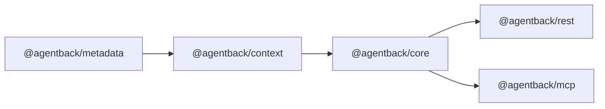

# @agentback/context

> Inversion-of-control container — the DI substrate everything else is built on.

ESM port of [`@loopback/context`](https://github.com/loopbackio/loopback-next/tree/master/packages/context).
A `Context` is a hierarchical registry of `Binding`s. Bindings can be resolved
synchronously or asynchronously, scoped per-request or as singletons, and
discovered by tag. The `@inject` decorator and its variants wire dependencies
into constructors, properties, and methods at resolution time.

Re-exports everything from `@agentback/metadata` so downstream packages
only need to import from `@agentback/context`.

## What it provides

**Container**

- `Context` — the IoC container; supports parent–child hierarchies
- `Binding` / `BindingKey` / `BindingScope` — define and scope a resolvable value
- `BindingFilter`, `filterByTag` — query bindings by tag or predicate
- `ContextView` / `createViewGetter` — live view over a filtered set of bindings

**Injection decorators**

- `@inject(key)` — inject a binding by key
- `@inject.tag(tag)` — inject all bindings matching a tag
- `@inject.view(filter)` — inject a live `ContextView`
- `@inject.getter(key)` — inject a lazy getter (avoids circular deps)
- `@inject.setter(key)` — inject a setter for a binding
- `@config(path?)` — inject from the binding's config subtree
- `@injectable(spec)` / `@bind(spec)` — decorate a class with its binding spec

**Interception**

- `@intercept(...)`, `InterceptorChain`, `invokeMethodWithInterceptors` —
  AOP-style interceptors on method calls

**Providers & resolution**

- `Provider<T>` — single-method factory class
- `instantiateClass`, `invokeMethod`, `resolveInjectedArguments` — resolution
  helpers
- `ResolutionSession`, `ResolutionError` — dependency-graph tracking and error
  reporting

## Usage

```ts
import {
  Context,
  inject,
  injectable,
  BindingScope,
} from '@agentback/context';

@injectable({scope: BindingScope.SINGLETON})
class Greeter {
  greet(name: string) {
    return `Hello, ${name}!`;
  }
}

class App {
  constructor(@inject('greeter') private greeter: Greeter) {}
  run() {
    console.log(this.greeter.greet('world'));
  }
}

const ctx = new Context('app');
ctx.bind('greeter').toClass(Greeter);
ctx.bind('app').toClass(App);

const app = await ctx.get<App>('app');
app.run();
```

## Layering



Depends on: `@agentback/metadata`.  
`@agentback/context` is the DI foundation; every other package in the
monorepo ultimately sits above it in the stack.
