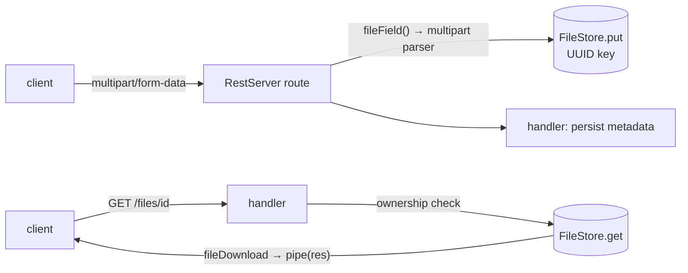

# @agentback/files

> Transport-agnostic file storage: a `FileStore` port + an in-memory adapter.

The storage seam behind AgentBack's first-class file upload/download. REST
handlers never touch a storage SDK — they declare a `fileField()` on a route's
body schema (uploads stream straight to the bound `FileStore`) and `return
fileDownload(...)` (downloads stream back out). Bind any `FileStore`
implementation at `FILE_STORE`; the [`@agentback/files-s3`](../files-s3) adapter
is the production one.

## The port

```ts
import {FILE_STORE, type FileStore} from '@agentback/files';

interface FileStore {
  put(key, body: Readable | Buffer, opts?): Promise<StoredFile>;
  get(key): Promise<RetrievedFile>;       // throws FileNotFoundError if absent
  exists(key): Promise<boolean>;
  delete(key): Promise<void>;
  presignedPut?(key, opts?): Promise<string>;  // optional (direct-to-storage)
  presignedGet?(key, opts?): Promise<string>;  // optional
}
```

Keys are **opaque and server-generated** — callers pass a UUID, never a
client-controlled path. `get` throws `FileNotFoundError` (HTTP-free; the REST
layer maps it to 404).

## Flow



## Adapters

- **`InMemoryFileStore`** (here) — buffers in a `Map`; tests/dev only.
- **`FsFileStore`** (here) — local filesystem; streams to/from `<baseDir>/<key>`
  with a metadata sidecar. Single-node / self-hosted / dev-with-persistence.
- **`S3FileStore`** (`@agentback/files-s3`) — streams to S3 via AWS SDK v3.

## Testing

`@agentback/files/testing` exports `runFileStoreConformance(label, makeStore)`
— the port contract as a reusable suite. Every adapter runs it:

```ts
import {runFileStoreConformance} from '@agentback/files/testing';
runFileStoreConformance('MyStore', () => new MyStore());
```

See [`examples/hello-uploads`](../../examples/hello-uploads) for the end-to-end
recipe (upload, list, owner-scoped download) and `@agentback/rest`'s
`fileField` / `fileResponse` for the REST integration.
