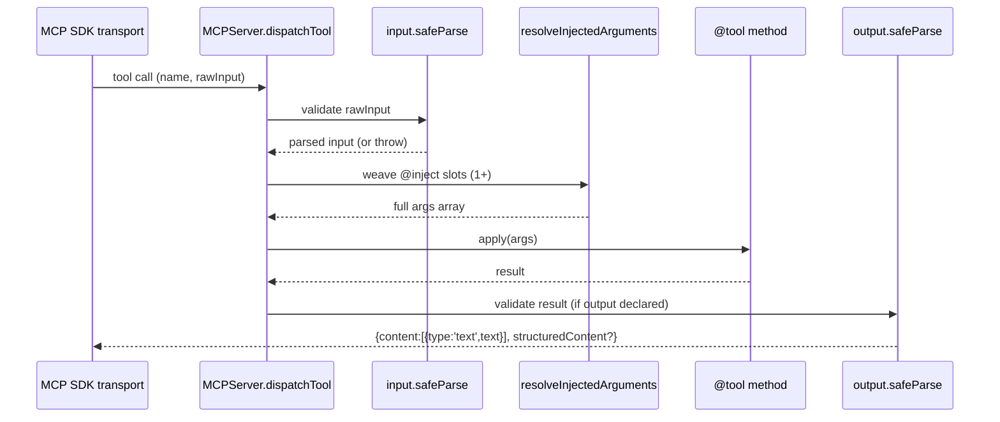

# @agentback/mcp

> Decorator-driven MCP server: `@mcpServer`, `@tool`, `@resource`, `@prompt` — Zod schemas on the decorator, `@inject` inside the method, official `@modelcontextprotocol/sdk` on the wire.

Define an MCP server as a plain DI-managed class. The `MCPServer` discovers every class tagged `mcpServer` at startup, registers its tools/resources/prompts with the SDK, and connects a stdio transport by default. For HTTP transport see `@agentback/mcp-http`.

```bash
pnpm add @agentback/mcp zod
```

## What it provides

- `@mcpServer()` — class decorator; shorthand for `@bind({tags:{mcpServer:true}})`. Marks the class as a tool/resource/prompt contributor.
- `@tool(name, {input?, output?, description?, title?, scope?})` — method decorator. `input` and `output` are `ZodObject` schemas. When `input` is set, slot 0 of the method is the validated `z.infer<typeof input>` bundle; `@inject(...)` lives at slot 1+. When `output` is set, the return type is constrained at compile time and validated at runtime.
- `@resource(name, uri, {description?, mimeType?})` — method decorator. Method return value is wrapped in the MCP `{contents:[…]}` shape.
- `@prompt(name, {description?})` — method decorator. Method return value is wrapped in the MCP `{messages:[…]}` shape.
- `MCPComponent` — registers `MCPServer` as the application's `Server`; mount with `app.component(MCPComponent)`.
- `MCPApplication` — `Application` subclass with `MCPComponent` pre-mounted; for stdio-only servers.
- `MCPServer` — the server class. Exposes `listTools()`, `listResources()`, `listPrompts()`, `callTool()`, `readResource()`, `getPrompt()` for in-process introspection (used by `@agentback/mcp-inspector`). Also `buildServer(options)` to produce a fresh SDK `McpServer` per session for Streamable HTTP transports.
- `MCPBindings.SERVER`, `MCPBindings.REQUEST_AUTH` — DI binding keys.
- `ToolMetadata`, `ResourceMetadata`, `PromptMetadata` — types stored on the decorator and read by `MCPServer`.

## Usage

```ts
import {z} from 'zod';
import {MCPApplication} from '@agentback/mcp';
import {mcpServer, tool, resource, prompt} from '@agentback/mcp';
import {inject} from '@agentback/context';

const ForecastInput = z.object({city: z.string().min(1)});
const ForecastOutput = z.object({forecast: z.string(), unit: z.string()});

@mcpServer()
class WeatherTools {
  constructor(@inject('services.weather') private weather: WeatherService) {}

  @tool('get_forecast', {
    input: ForecastInput,
    output: ForecastOutput,
    description: 'Current weather for a city',
  })
  async getForecast(input: z.infer<typeof ForecastInput>) {
    return this.weather.forecast(input.city);
  }

  @resource('climate_zones', 'weather://climate-zones', {
    description: 'Static climate zone reference',
    mimeType: 'application/json',
  })
  async climateZones() {
    return [{zone: 'tropical', lat: '0-23.5°'}];
  }

  @prompt('forecast_prompt', {
    description: 'Prompt template for weather queries',
  })
  async forecastPrompt() {
    return 'Describe the weather in {city} in plain English.';
  }
}

const app = new MCPApplication();
app.configure('servers.MCPServer').to({name: 'weather', version: '1.0.0'});
app.service(WeatherTools);
await app.start(); // stdio transport connects; blocks until stdin closes
```

**Hybrid REST + MCP** — mount on a `RestApplication` instead:

```ts
import {RestApplication} from '@agentback/rest';
import {MCPComponent} from '@agentback/mcp';

const app = new RestApplication();
app.component(MCPComponent);
app.service(WeatherTools);
await app.start();
```

**Scope-gated tools** (authenticated HTTP transport via `@agentback/mcp-http`):

```ts
@tool('admin_stats', {input: StatsIn, scope: 'admin',
                      description: 'Only visible to sessions with the admin scope'})
async adminStats(input: z.infer<typeof StatsIn>,
                 @inject(MCPBindings.REQUEST_AUTH, {optional: true}) auth?: AuthInfo) { … }
```

## Tool dispatch



## Streaming tools

A `@tool` method that returns an **async iterable** (an async generator) is **drained** when invoked over MCP: each yielded item is relayed to the caller as a `notifications/progress` notification via the per-request `MCPBindings.PROGRESS` fn (a no-op when the caller sent no `progressToken`), and the **collected items become the tool result**. This lets a single method that is also a `@get(..., {streamOf: X})` SSE route "stream" over MCP with no new metadata — the same generator pumps items through progress here and frames them as SSE on the REST path (a separate `sendStream` code path that is untouched by this).

```ts
@tool('count_up', {input: CountIn, output: z.array(Item)})
async *countUp(input: z.infer<typeof CountIn>) {
  for (let i = 1; i <= input.n; i++) yield {n: i};
}
```

Notes:

- **`output:` describes the COLLECTED shape**, not a single item — typically `z.array(ItemSchema)`. Output validation runs against the collected array.
- **Progress shape**: `progress` is the 1-based item index; `total` is omitted (unknown for a generator); `message` is a short JSON preview of the item.
- **Cleanup**: the generator's `return()` is called in a `finally`, so a `try/finally` inside the method runs even if a later step throws.
- **Empty generator** → `[]`. Strings and arrays are not async-iterable, so plain results are unaffected.
- A streaming method's return type is an `AsyncGenerator`, which the typed `output:` overload (constraining the return to the collected array) does not statically describe — expect a localized cast at the `@tool` line.

## Layering

Depends on: `@agentback/context`, `@agentback/core`, `@agentback/metadata`, `@modelcontextprotocol/sdk`, `zod`.

Sits between the DI container (`context`/`core`) and the MCP SDK. The REST layer has no dependency on this package; the two servers coexist independently on the same `Application`.
