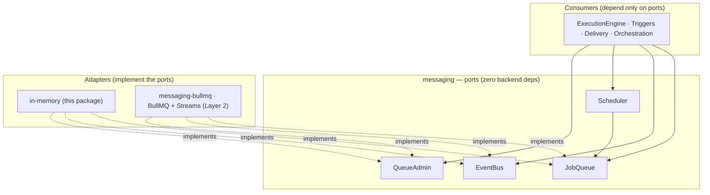

# @agentback/messaging

> Transport-agnostic, Zod-typed messaging ports — `JobQueue`, `EventBus`, `QueueAdmin`, `Scheduler` — with an in-memory adapter and a shared conformance suite.

The durable-messaging substrate for the agent runtime. It defines **ports** (interfaces) that the engine, triggers, delivery, and orchestration depend on, plus an **in-memory adapter** so the whole stack runs and tests with no external infrastructure. Concrete backends (BullMQ + Redis Streams) are separate adapters that implement the same ports and must pass the same conformance suite — so swapping backends is safe by construction.

This is **Layer 1** of the messaging architecture (see the [architecture map spec](../../docs/superpowers/specs/2026-06-06-messaging-architecture-map-design.md)). The bus sits _under_ the `ExecutionEngine`: triggers enqueue jobs, a worker drives the same engine — durability and horizontal scale without a second execution model.

## What it provides

- **Typed descriptors** — `defineQueue(name, schema)` / `defineTopic(name, schema)` bind a name to a Zod schema. Payloads are validated on enqueue/publish and decoded on consume; the handler receives `z.infer`-typed data.
- **`JobQueue`** — durable job/worker port: `enqueue` · `process` (worker) · `get` · `cancel`. Options cover `delayMs`, `attempts`/`backoff`, `removeOnComplete/Fail`, `jobId` dedup.
- **`EventBus`** — pub/sub fan-out: `publish` · `subscribe(topic, group, handler)`. At-least-once per consumer group, **implicit ack-on-resolve** (handler resolves → ack; throws → redeliver), `MsgMeta.deliveryCount` for poison handling.
- **`QueueAdmin`** — ops surface kept off the hot path: `stats` · `drain` · `pause`/`resume` · `discardStalled`.
- **`Scheduler`** — thin helper over `JobQueue`; expresses cron/interval as repeatable jobs (works over any adapter).
- **`@jobProcessor` / `@subscriber`** decorators + `MessagingBootstrapper` — register handlers declaratively; the bootstrapper discovers tagged bindings at `start()` and wires them, mirroring `@tool`/`@mcpServer`.
- **In-memory adapter** — `InMemoryJobQueue` / `InMemoryEventBus` / `InMemoryQueueAdmin` + `InMemoryMessagingComponent` (binds all four ports). Faithful enough for tests; records but does not fire repeatables or honor priority (those are Layer-2 / BullMQ concerns).
- **Shared conformance suite** — exported from `@agentback/messaging/testing`; every adapter (in-memory now, BullMQ in Layer 2) runs the identical behavioral spec.

## Usage

```ts
import {z} from 'zod';
import {
  defineQueue,
  InMemoryMessagingComponent,
  JOB_QUEUE,
  jobProcessor,
  MESSAGING_PROCESSOR_TAG,
  type JobContext,
} from '@agentback/messaging';
import {Application} from '@agentback/core';

const EmailJob = defineQueue(
  'email.send',
  z.object({to: z.string(), body: z.string()}),
);

class EmailWorker {
  @jobProcessor(EmailJob, {concurrency: 10})
  async send(job: JobContext<{to: string; body: string}>) {
    // job.data is typed + already Zod-decoded
  }
}

const app = new Application();
app.component(InMemoryMessagingComponent); // binds the four ports + bootstrapper
app.bind('workers.Email').toClass(EmailWorker).tag(MESSAGING_PROCESSOR_TAG);
await app.start(); // bootstrapper wires @jobProcessor

const jobs = await app.get(JOB_QUEUE);
await jobs.enqueue(EmailJob, {to: 'a@b.co', body: 'hi'}); // validated on the way in
```



## Layering

Depends on: `@agentback/core`, `@agentback/metadata` (decorators),
`@agentback/common` (logging), `zod`. **Zero backend deps** — no
`ioredis`/`bullmq`. The Redis/BullMQ adapter (Layer 2) depends on _this_
package, never the reverse.

## Notes

- **Validate on consume, not just produce.** A message can sit across a deploy, so the schema is re-asserted at handle time — schema drift or corruption becomes a poison message routed to fail/redelivery, never a deep handler crash.
- **In-memory limitations (by design):** repeatable firing (`everyMs`/cron) and `priority` ordering are recorded/validated but not acted on here — they belong to the BullMQ adapter. See the L1 notes in the adapter source and the spec's non-goals.
