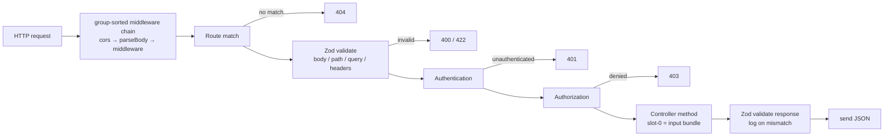

# @agentback/rest

> Minimal REST server: schema-driven routing, Zod request/response validation, auth integration, and `/openapi.json` — all in one fixed pipeline.

`RestServer` is a slim Express wrapper that mounts controllers registered with `@get`/`@post`/… decorators,
validates every request and response against the Zod schemas declared on those decorators, and serves the
assembled OpenAPI 3.1.1 document at `/openapi.json`. Authentication and authorization hooks run in the same
pipeline via `@agentback/authentication` and `@agentback/authorization` metadata.

There are no sequences or action chains — `RestServer.dispatch` is a single fixed pipeline. Per-route
customization lives on decorator options; cross-cutting concerns go in Express middleware registered via
`app.middleware()`; deeper changes come from subclassing `RestServer` and overriding `dispatch`,
`makeHandler`, `sendResult`, or `sendError`.

## What it provides

- `RestServer` — Express-backed server; mounts controllers, validates I/O, assembles and serves the spec
- `RestApplication` — `Application` subclass with `MiddlewareMixin`; pre-binds `RestServer`; exposes `app.restController()`, `app.restServer`, `app.middleware()`, `app.expressMiddleware()`
- `RestServerConfig` — `{port?, host?, basePath?, openApiSpec?: {path?, overrides?}, cors?}`
- `RestBindings` — DI keys: `RestBindings.SERVER`, `RestBindings.CONFIG`
- Controllers are discovered by the core `controller` tag (`CoreTags.CONTROLLER` from `@agentback/core`); `app.restController()` is a thin, REST-flavored alias for `app.controller()` and adds no separate tag
- Error helpers: `invalidParameter(field, message)`, `invalidRequestBody(details)`, `zodIssuesToDetails(issues)` — produce HTTP 400/422 error shapes from Zod validation failures

## Request pipeline

> A standalone diagram of the middleware chain that fronts this pipeline — the
> group-sorted `cors → parseBody → middleware` cascade, mounted as the first
> Express handler — lives at
> [`docs/architecture/diagrams/middleware-chain.html`](../../docs/architecture/diagrams/middleware-chain.html).



## Usage

```ts
import {z} from 'zod';
import {api, get, post} from '@agentback/openapi';
import {RestApplication} from '@agentback/rest';

const GreetPath = z.object({name: z.string().min(1).max(64)});
const Greeting = z.object({greeting: z.string()});

@api({basePath: '/greet'})
class GreetController {
  @get('/hello/{name}', {path: GreetPath, response: Greeting})
  async hello(input: {path: z.infer<typeof GreetPath>}) {
    return {greeting: `Hello, ${input.path.name}!`};
  }

  @post('/echo', {body: Greeting, response: Greeting, status: 200})
  async echo(input: {body: z.infer<typeof Greeting>}) {
    return input.body;
  }
}

const app = new RestApplication({
  rest: {port: 3000, cors: true},
});
app.restController(GreetController);
await app.start();
// GET  /greet/hello/Alice  → {"greeting":"Hello, Alice!"}
// GET  /openapi.json       → OpenAPI 3.1.1 document
```

**Adding middleware** (runs before every route handler):

```ts
import helmet from 'helmet';

app.expressMiddleware(helmet);
// or a raw function:
app.middleware((ctx, next) => {
  /* ... */ return next();
});
```

**Subclassing for custom error shapes:**

```ts
import {RestServer} from '@agentback/rest';

class MyServer extends RestServer {
  protected override sendError(res, err) {
    res.status(err.statusCode ?? 500).json({ok: false, error: err.message});
  }
}
// app.server(MyServer);
```

**Config reference:**

| Option                  | Default           | Notes                                 |
| ----------------------- | ----------------- | ------------------------------------- |
| `port`                  | `3000`            | TCP port                              |
| `host`                  | `'127.0.0.1'`     | Bind address                          |
| `basePath`              | `''`              | Prefix for all routes                 |
| `openApiSpec.path`      | `'/openapi.json'` | Spec endpoint                         |
| `openApiSpec.overrides` | `{}`              | Merged into assembled spec            |
| `cors`                  | `undefined`       | `true` for defaults, or `CorsOptions` |

## Layering

Depends on: `@agentback/context`, `@agentback/core`, `@agentback/express`,
`@agentback/http-server`, `@agentback/metadata`, `@agentback/openapi`,
`@agentback/authentication`, `@agentback/authorization`, `@agentback/security`,
`cors`, `express ^4`, `zod ^4`. Sits at the top of the server stack; `@agentback/rest-explorer`
and `@agentback/console` mount additional UI routes on top of it.
